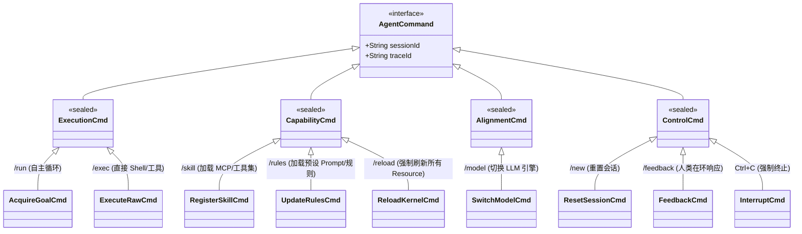
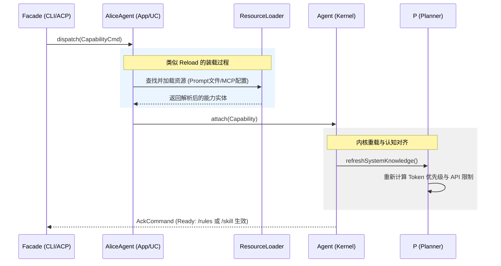

## 1. Alice AgentCommand 完整指令集

我们将指令按**驱动性质**重新划分为四大类，并明确 `/rules` 与 `/skill` 的联动关系。

---

## 2. 核心 Use Case 指令详解

| 类别 | 指令 (UC) | 映射功能 | **Reload 逻辑 (能力装载细节)** |
| --- | --- | --- | --- |
| **能力 (Capability)** | **`/skill`** | 注册工具 | 触发 `ToolGateway` 扫描新工具定义，并通知 **P (Planner)** 更新 API Schema 认知。 |
| **能力 (Capability)** | **`/rules`** | 注册提示词 | 触发 `Memory` 加载 `.prompt` 文件，并通知 **P (Planner)** 重新 Rebase 整个 `System Prompt`。 |
| **能力 (Capability)** | **`/reload`** | 热重载 | 强制重新扫描 `alice-core-agent` 的所有外部能力源，确保本地 Dell R730 上的文件变更立即生效。 |
| **执行 (Execution)** | **`/run`** | 目标驱动 | 开启 P-E-M-T-V 循环。 |
| **执行 (Execution)** | **`/exec`** | 原生驱动 | 直接执行 `ls`, `git`, `nvidia-smi` 等底层指令。 |
| **对齐 (Alignment)** | **`/model`** | 引擎驱动 | 切换 LLM 后，同步刷新 **V (Verification)** 模块的审计敏感度。 |
| **控制 (Control)** | **`/feedback`** | HITL 驱动 | 响应内核的 `AskHumanCmd`，解锁挂起状态。 |

---

## 3. 时序图：能力装载的通用驱动流 (Skill & Rules)

由于 `/rules` 和 `/skill` 的相似性，它们共用这一套“加载-通知-重载”的时序。

