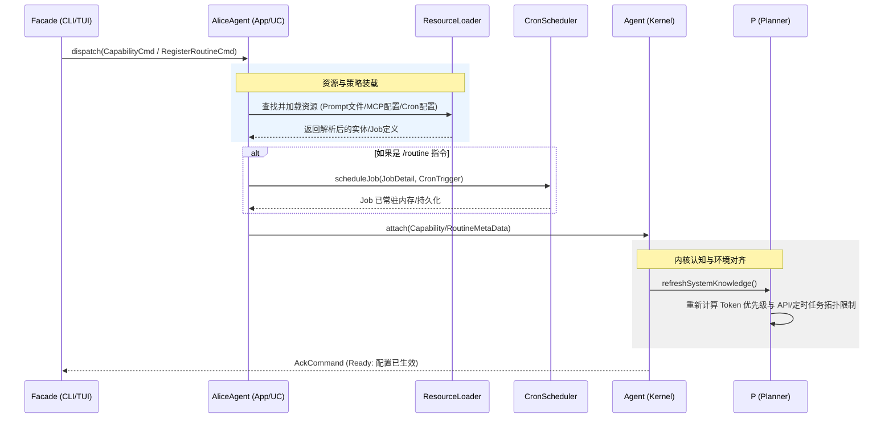
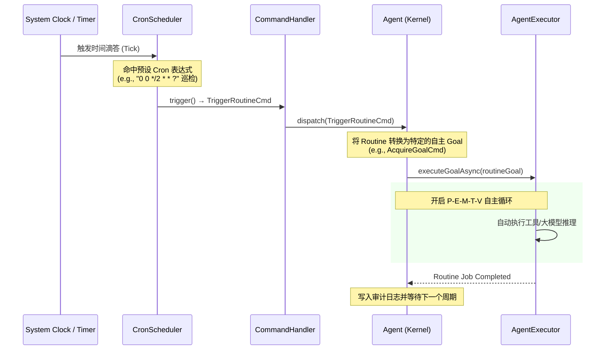
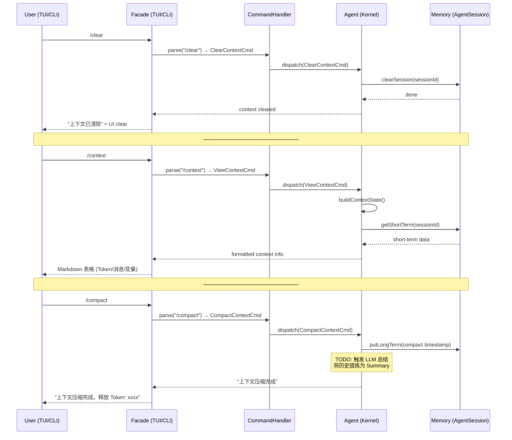
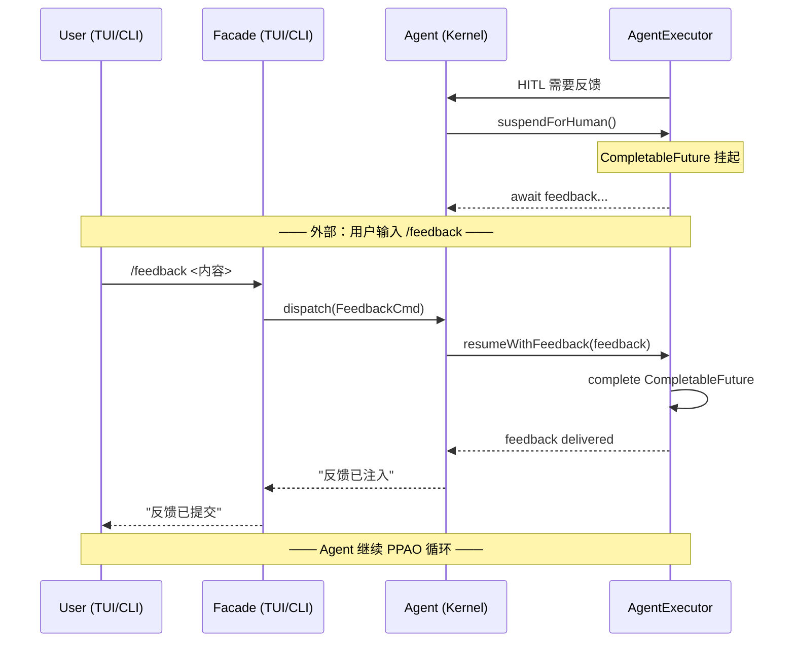
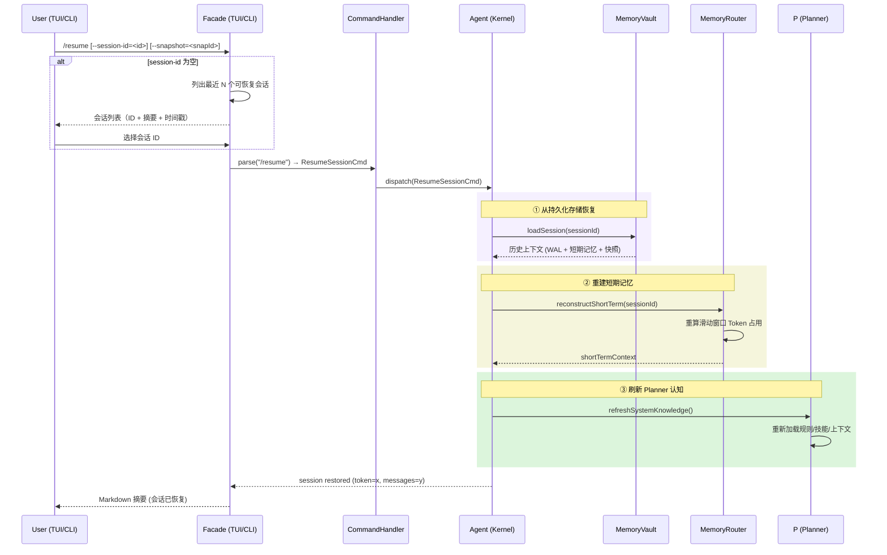

# alice-agent-command DESIGN
**summary**: Complete command set design for the sealed AgentCommand interface hierarchy with Routine-Time and Prompt support
**read_when**:
- implementing or modifying sealed command interface
- adding or modifying prompt/rule commands
**scope**:
- alice-agent-command
**status**: active
**updated**: 2026-07-03

已将定时/常规调度任务（Routine/Time 驱动）融合至整体设计，新增**常规调度驱动 (Routine-Time)** 大类，专门承接时间、周期、Cron 表达式触发的自主任务；同步更新类图、用例映射表，并补充定时触发相关时序流程。

## 1. Alice AgentCommand 完整指令集
指令按**驱动性质**划分为五大类，同时明确 `/rules`、`/skill`、`/routine` 之间的联动逻辑。

```mermaid
classDiagram
    class AgentCommand {
        <<interface>>
        +String sessionId
        +String traceId
    }

    %% 1. 任务驱动 (Execution) - 消耗 Token 的实际工作
    class ExecutionCmd {
        <<sealed>>
    }
    AgentCommand <|-- ExecutionCmd
    ExecutionCmd <|-- AcquireGoalCmd : /run (自主循环)
    ExecutionCmd <|-- ExecuteRawCmd : /exec (直接 Shell/工具)

    %% 2. 能力装载 (Capability) - 需要 Reload 的静态/动态资源
    class CapabilityCmd {
        <<sealed>>
    }
    AgentCommand <|-- CapabilityCmd
    CapabilityCmd <|-- RegisterSkillCmd : /skill (加载 MCP/工具集)
    CapabilityCmd <|-- UpdateRulesCmd : /rules (加载预设 Prompt/规则)
    CapabilityCmd <|-- LoadPromptCmd : /prompt (加载 managed prompt/外部文件)
    CapabilityCmd <|-- ListPromptsCmd : /prompt (列出 managed prompts)
    CapabilityCmd <|-- ReloadKernelCmd : /reload (强制刷新所有 Resource)

    %% 3. 运行配置 (Alignment) - 调整内核参数
    class AlignmentCmd {
        <<sealed>>
    }
    AgentCommand <|-- AlignmentCmd
    AlignmentCmd <|-- SwitchModelCmd : /model (切换 LLM 引擎)

    %% 4. 控制与反馈 (Control) - 生命周期与 HITL
    class ControlCmd {
        <<sealed>>
    }
    AgentCommand <|-- ControlCmd
    ControlCmd <|-- ResetSessionCmd : /new (重置会话)
    ControlCmd <|-- FeedbackCmd : /feedback (人类在环响应)
    ControlCmd <|-- InterruptCmd : Ctrl+C (强制终止)
    ControlCmd <|-- ClearContextCmd : /clear (清除上下文)
    ControlCmd <|-- ViewContextCmd : /context (查看上下文)
    ControlCmd <|-- CompactContextCmd : /compact (压缩上下文)
    ControlCmd <|-- ResumeSessionCmd : /resume (继续历史会话)

    %% 5. 常规调度驱动 (Routine-Time) - 基于时间的自主触发 [NEW]
    class RoutineTimeCmd {
        <<sealed>>
    }
    AgentCommand <|-- RoutineTimeCmd
    RoutineTimeCmd <|-- RegisterRoutineCmd : /routine (注册定时/周期任务)
    RoutineTimeCmd <|-- TriggerRoutineCmd : [System] TimeTriggered (时间到期触发)
```

## 2. 核心 Use Case 指令详解
区分 **CLI 长参数（`--xxx`）** 与 **TUI 交互命令（`/xxx`）**；`TimeTriggered` 为内核自动触发，不对外暴露交互入口。

| 类别 | CLI 模式 (`--`) | TUI 模式 (`/`) | 映射功能 | Reload 与调度细节 |
| ---- | --------------- | -------------- | -------- | ----------------- |
| 能力 (Capability) | `--skill` | `/skill` | 注册工具 | 触发 `ToolGateway` 扫描新工具定义，并通知 **P (Planner)** 更新 API Schema 认知。 |
| 能力 (Capability) | `--rules` | `/rules` | 注册提示词 | 触发 `Memory` 加载 `.prompt` 文件，并通知 **P (Planner)** 重新 Rebase 整个 `System Prompt`。 |
| 能力 (Capability) | `--prompt` | `/prompt:<name>` | 加载 managed prompt | 从 `~/.alice/prompts/` 查找 `<name>.ftl`，拷贝到 `~/.alice/rules/` 后调用 `PromptManager.reloadFromDisk()`。| 能力 (Capability) | `--prompt` | `/prompt <path>` | 加载外部 prompt 文件 | 读取外部文件（.md/.ftl/.txt），拷贝到 `~/.alice/rules/` 或 `~/.alice/prompts/` 后刷新 PromptManager 缓存。|
| 能力 (Capability) | `--prompt` | `/prompt` | 列出 managed prompts | 扫描 `~/.alice/prompts/*.ftl` 返回所有可用的 prompt 名称列表，供用户选择使用 `/prompt:<name>` 加载。 |
| 能力 (Capability) | `--reload` | `/reload` | 热重载 | 强制重新扫描 `alice-core-agent` 所有外部能力源，确保本地 Dell R730 文件变更即时生效。 |
| 执行 (Execution) | `--run` | `/run` | 目标驱动 | 开启 P-E-M-T-V 自主执行循环。 |
| 执行 (Execution) | `--exec` | `/exec` | 原生驱动 | 直接执行 `ls`、`git`、`nvidia-smi` 等底层指令。 |
| 对齐 (Alignment) | `--model` | `/model` | 引擎驱动 | 切换 LLM 后，同步刷新 **V (Verification)** 模块审计敏感度。 |
| 控制 (Control) | `--clear` | `/clear` | 上下文管理 | 清空会话短期记忆（保留系统提示词/规则），重置 Token 计数器。 |
| 控制 (Control) | `--resume` | `/resume` | 会话恢复 | 从持久化存储中加载指定历史会话（WAL/Snapshot），重建上下文窗口、短期记忆与关联的快照/分支状态。 |
| 控制 (Control) | `--compact` | `/compact` | 上下文管理 | 历史对话写入 WAL，提炼为摘要快照，释放上下文窗口。 |
| 控制 (Control) | `--feedback` | `/feedback` | HITL 驱动 | 响应内核 `AskHumanCmd`，解除任务挂起状态。 |
| 调度 (Routine-Time) | `--routine` | `/routine` | 计划任务管理 | 动态新增/修改 Cron 表达式、周期任务（如服务器定时巡检、日报推送）。 |
| 调度 (Routine-Time) | N/A | N/A | 定时内核唤醒 | 【TimeTriggered 内核内置自动触发】 由调度器驱动，绕过 CLI/TUI 直接向内核派发预设执行目标。 |

## 3. 时序图：能力与常规任务装载流 (Skill & Rules & Routine)
`/rules`、`/skill`、`/routine` 共享资源装载流程；其中 `/routine` 会额外启动 `CronScheduler` 调度服务。

## 4. 时序图：常规调度时间触发流 (Routine-Time Execution)
到达预设时间节点后，调度器自动驱动 Agent 启动 P-E-M-T-V 自主执行循环，无需人工介入。

## 5. 时序图：上下文管理驱动流 (/clear, /context, /compact)

## 6. 时序图：HITL 反馈流 (/feedback)

## 7. 时序图：会话恢复流 (/resume)
从持久化存储中加载历史会话，重建上下文窗口与短期记忆；支持指定 `--session-id` 或由调度器自动键恢复。

