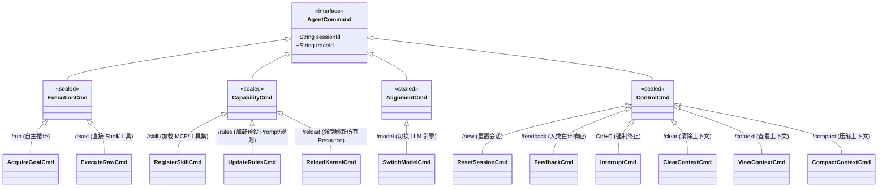
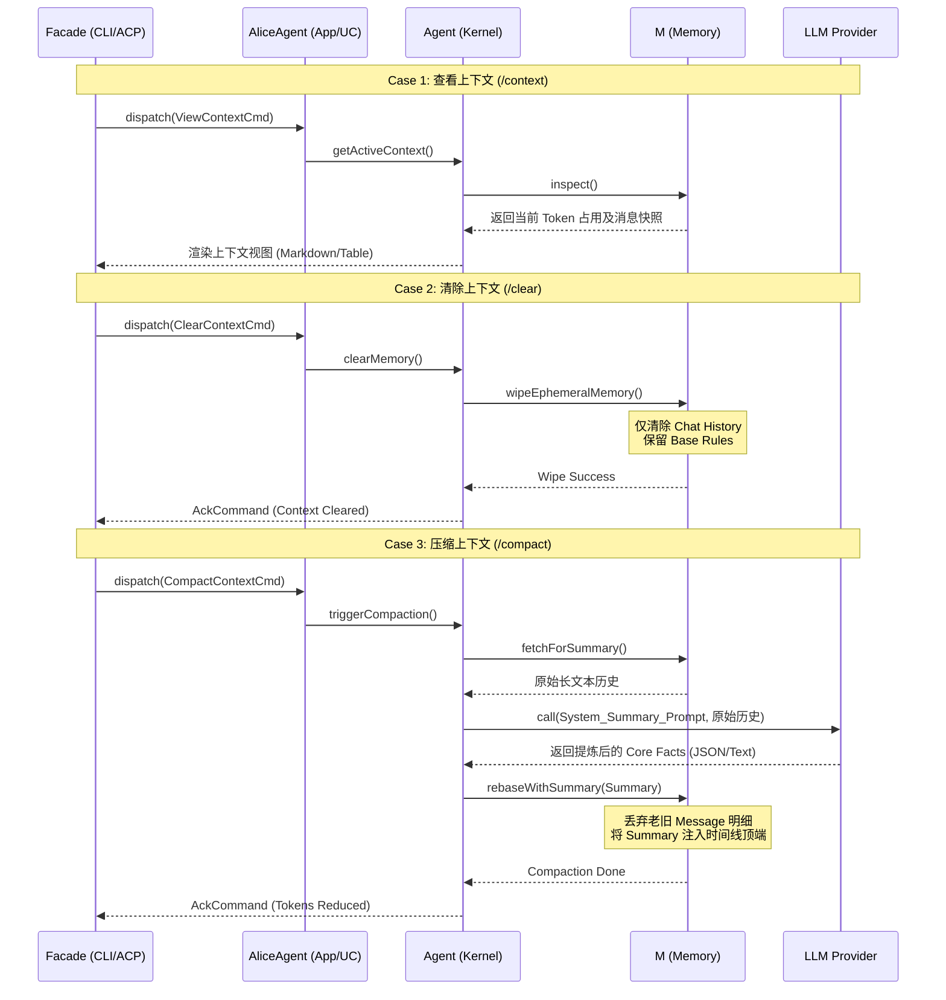

为了将新增的三个上下文相关指令（`/clear`、`/context`、`/compact`）完美融入现有的 **Alice Agent 架构**中，我们需要对**指令分类（类图）**、详细用例（表格）**以及**核心交互（时序图）进行相应的扩展与更新。

由于这三个指令的核心客体是 **`Context` (上下文/记忆/状态)**，它们天然属于控制或管理 Agent 状态的范畴。为了保持分类的严谨性，我们将其归类到 **`ControlCmd` (控制与反馈)** 中，并明确它们对 **M (Memory/MemoryManager)** 模块的驱动关系。

以下是更新后的完整设计方案：

---

## 1. Alice AgentCommand 完整指令集（更新版）

在 `ControlCmd` 下新增了三个叶子节点，分别对应上下文的清除、查看与压缩。

---

## 2. 核心 Use Case 指令详解（更新版）

| 类别 | 指令 (UC) | 映射功能 | **内核驱动与重载逻辑细节** |
| --- | --- | --- | --- |
| **能力 (Capability)** | `/skill` | 注册工具 | 触发 `ToolGateway` 扫描新工具定义，并通知 **P (Planner)** 更新 API Schema 认知。 |
| **能力 (Capability)** | `/rules` | 注册提示词 | 触发 `Memory` 加载 `.prompt` 文件，并通知 **P (Planner)** 重新 Rebase 整个 `System Prompt`。 |
| **能力 (Capability)** | `/reload` | 热重载 | 强制重新扫描 `alice-core-agent` 的所有外部能力源，确保本地 Dell R730 上的文件变更立即生效。 |
| **执行 (Execution)** | `/run` | 目标驱动 | 开启 P-E-M-T-V 循环。 |
| **执行 (Execution)** | `/exec` | 原生驱动 | 直接执行 `ls`, `git`, `nvidia-smi` 等底层指令。 |
| **对齐 (Alignment)** | `/model` | 引擎驱动 | 切换 LLM 后，同步刷新 **V (Verification)** 模块的审计敏感度。 |
| **控制 (Control)** | `/feedback` | HITL 驱动 | 响应内核的 `AskHumanCmd`，解锁挂起状态。 |
| **控制 (Control)** | **`/clear`** | 上下文清除 | 显式清空当前 Session 的 **M (Memory)** 缓存（保留 System Prompt/Rules），重置 Token 计数器。 |
| **控制 (Control)** | **`/context`** | 上下文查看 | 从 **M (Memory)** 中拉取当前全量滑动窗口内的线索、对话历史及 Token 占用统计，并格式化输出。 |
| **控制 (Control)** | **`/compact`** | 上下文压缩 | 强制触发 **M (Memory)** 总结机制。通过 LLM 将历史对话提炼为 Summary 事实快照，释放 Context Window。 |

---

## 3. 时序图：上下文管理驱动流 (Clear / Context / Compact)

新增的三个命令主要与内核的 **M (Memory)** 模块及 LLM 交互。以下是它们在系统内部的执行时序：

