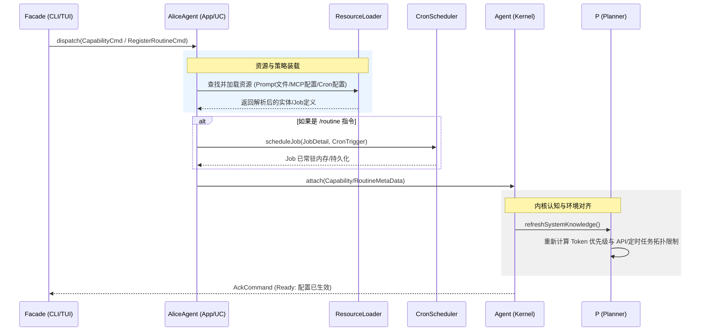
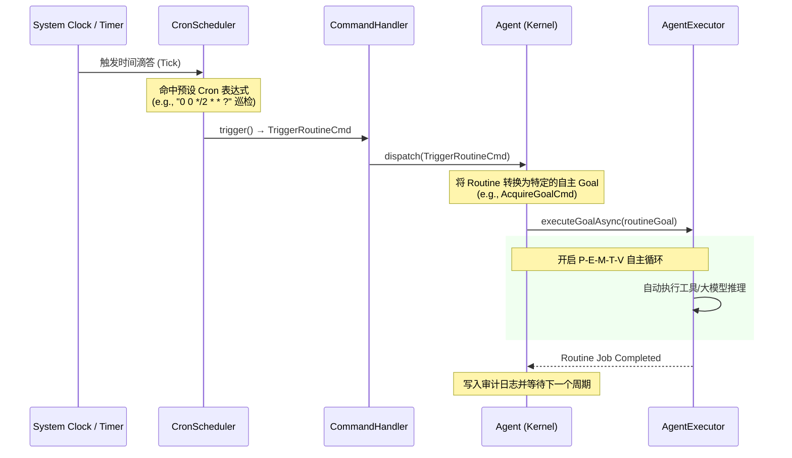
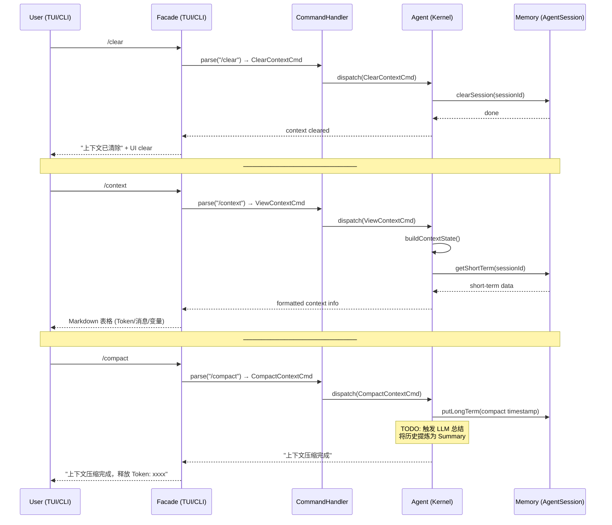
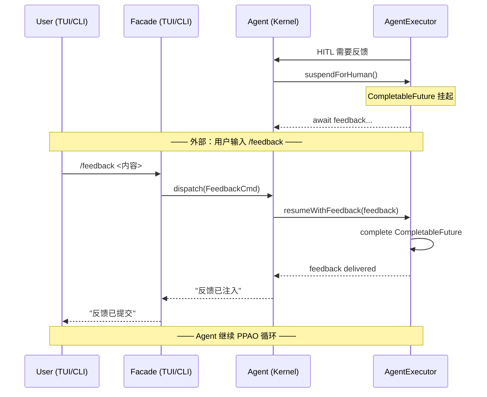
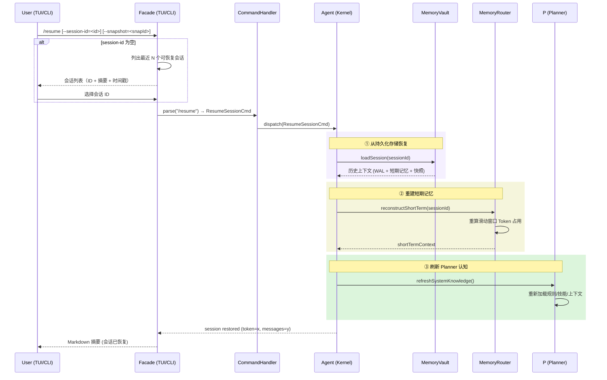

# alice-agent-proto DESIGN（协议契约层）

> **本次调整（2026-09-19 评审结论）**：本模块从"指令抽象层"升级为**协议契约层**——**对内/对外同一份契约**：
> ① 入方向：`AgentCommand` 密封体系（已有 ✓，新增 `SteerCmd`/`AbortCmd`）；
> ② 出方向：`StepEvent` 事件帧（v1，帧规范见 `docs/alice-agent-proto/PROTOCOL.md`）；
> ③ 端口：`AgentCommandDispatcher`（`dispatch(cmd) → Flow<StepEvent>`——实现放 `alice-agent-runtime`，transport 调用）；
> ④ codec：JSON v1 双向编解码（Jackson；入方向命令 + 出方向事件同一套兼容规则）；
> ⑤ 版本纪律：只增字段 / 不改名 / 不改语义 / 枚举只加不删 / 帧带 `v`。
>
> 传输（InProcess / StdioJSONL / HTTP+SSE / ACP）与各门面**只依赖本模块契约，不依赖 core 实现**；
> 工作项与验收见 `docs/release/20260919/协议层转正与门面收敛-清单.md`（A 组）。

已将定时/常规调度任务（Routine/Time 驱动）融合至整体设计，新增**常规调度驱动 (Routine-Time)** 大类，专门承接时间、周期、Cron 表达式触发的自主任务；同步更新类图、用例映射表，并补充定时触发相关时序流程。

## 1. Alice AgentCommand 完整指令集
指令按**驱动性质**划分为五大类，同时明确 `/rules`、`/skill`、`/routine` 之间的联动逻辑。

```mermaid
classDiagram
    class AgentCommand {
        <<interface>>
        +String sessionId
        +String traceId
    }

    %% 1. 任务驱动 (Execution) - 消耗 Token 的实际工作
    class ExecutionCmd {
        <<sealed>>
    }
    AgentCommand <|-- ExecutionCmd
    ExecutionCmd <|-- AcquireGoalCmd : /run (自主循环)
    ExecutionCmd <|-- ExecuteRawCmd : /exec (直接 Shell/工具)

    %% 2. 能力装载 (Capability) - 需要 Reload 的静态/动态资源
    class CapabilityCmd {
        <<sealed>>
    }
    AgentCommand <|-- CapabilityCmd
    CapabilityCmd <|-- RegisterSkillCmd : /skill (加载 MCP/工具集)
    CapabilityCmd <|-- UpdateRulesCmd : /rules (加载预设 Prompt/规则)
    CapabilityCmd <|-- LoadPromptCmd : /prompt (加载 managed prompt/外部文件)
    CapabilityCmd <|-- ListPromptsCmd : /prompt (列出 managed prompts)
    CapabilityCmd <|-- ReloadKernelCmd : /reload (强制刷新所有 Resource)

    %% 3. 运行配置 (Alignment) - 调整内核参数
    class AlignmentCmd {
        <<sealed>>
    }
    AgentCommand <|-- AlignmentCmd
    AlignmentCmd <|-- SwitchModelCmd : /model (切换 LLM 引擎)

    %% 4. 控制与反馈 (Control) - 生命周期与 HITL
    class ControlCmd {
        <<sealed>>
    }
    AgentCommand <|-- ControlCmd
    ControlCmd <|-- ResetSessionCmd : /new (重置会话)
    ControlCmd <|-- FeedbackCmd : /feedback (人类在环响应)
    ControlCmd <|-- InterruptCmd : Ctrl+C (强制终止)
    ControlCmd <|-- SteerCmd : /steer (人工插话·忙时插队) [2026-09-19 新增]
    ControlCmd <|-- AbortCmd : /abort (中止当前轮·会话保留) [2026-09-19 新增]
    ControlCmd <|-- ClearContextCmd : /clear (清除上下文)
    ControlCmd <|-- ViewContextCmd : /context (查看上下文)
    ControlCmd <|-- CompactContextCmd : /compact (压缩上下文)
    ControlCmd <|-- ResumeSessionCmd : /resume (继续历史会话)

    %% 5. 常规调度驱动 (Routine-Time) - 基于时间的自主触发 [NEW]
    class RoutineTimeCmd {
        <<sealed>>
    }
    AgentCommand <|-- RoutineTimeCmd
    RoutineTimeCmd <|-- RegisterRoutineCmd : /routine (注册定时/周期任务)
    RoutineTimeCmd <|-- TriggerRoutineCmd : [System] TimeTriggered (时间到期触发)
```



## 2. 核心 Use Case 指令详解
区分 **CLI 长参数（`--xxx`）** 与 **TUI 交互命令（`/xxx`）**；`TimeTriggered` 为内核自动触发，不对外暴露交互入口。

| 类别 | CLI 模式 (`--`) | TUI 模式 (`/`) | 映射功能 | Reload 与调度细节 |
| ---- | --------------- | -------------- | -------- | ----------------- |
| 能力 (Capability) | `--skill` | `/skill` | 注册工具 | 触发 `ToolGateway` 扫描新工具定义，并通知 **P (Planner)** 更新 API Schema 认知。 |
| 能力 (Capability) | `--rules` | `/rules` | 注册提示词 | 触发 `Memory` 加载 `.prompt` 文件，并通知 **P (Planner)** 重新 Rebase 整个 `System Prompt`。 |
| 能力 (Capability) | `--prompt` | `/prompt:<name>` | 加载 managed prompt | 从 `~/.alice/prompts/` 查找 `<name>.ftl`，拷贝到 `~/.alice/rules/` 后调用 `PromptManager.reloadFromDisk()`。| 能力 (Capability) | `--prompt` | `/prompt <path>` | 加载外部 prompt 文件 | 读取外部文件（.md/.ftl/.txt），拷贝到 `~/.alice/rules/` 或 `~/.alice/prompts/` 后刷新 PromptManager 缓存。|
| 能力 (Capability) | `--prompt` | `/prompt` | 列出 managed prompts | 扫描 `~/.alice/prompts/*.ftl` 返回所有可用的 prompt 名称列表，供用户选择使用 `/prompt:<name>` 加载。 |
| 能力 (Capability) | `--reload` | `/reload` | 热重载 | 强制重新扫描 `alice-core-agent` 所有外部能力源，确保本地 Dell R730 文件变更即时生效。 |
| 执行 (Execution) | `--run` | `/run` | 目标驱动 | 开启 P-E-M-T-V 自主执行循环。 |
| 执行 (Execution) | `--exec` | `/exec` | 原生驱动 | 直接执行 `ls`、`git`、`nvidia-smi` 等底层指令。 |
| 对齐 (Alignment) | `--model` | `/model` | 引擎驱动 | 切换 LLM 后，同步刷新 **V (Verification)** 模块审计敏感度。 |
| 控制 (Control) | `--clear` | `/clear` | 上下文管理 | 清空会话短期记忆（保留系统提示词/规则），重置 Token 计数器。 |
| 控制 (Control) | `--resume` | `/resume` | 会话恢复 | 从持久化存储中加载指定历史会话（WAL/Snapshot），重建上下文窗口、短期记忆与关联的快照/分支状态。 |
| 控制 (Control) | `--compact` | `/compact` | 上下文管理 | 历史对话写入 WAL，提炼为摘要快照，释放上下文窗口。 |
| 控制 (Control) | `--feedback` | `/feedback` | HITL 驱动 | 响应内核 `AskHumanCmd`，解除任务挂起状态。 |
| 调度 (Routine-Time) | `--routine` | `/routine` | 计划任务管理 | 动态新增/修改 Cron 表达式、周期任务（如服务器定时巡检、日报推送）。 |
| 调度 (Routine-Time) | N/A | N/A | 定时内核唤醒 | 【TimeTriggered 内核内置自动触发】<br>由调度器驱动，绕过 CLI/TUI 直接向内核派发预设执行目标。 |

## 3. 时序图：能力与常规任务装载流 (Skill & Rules & Routine)
`/rules`、`/skill`、`/routine` 共享资源装载流程；其中 `/routine` 会额外启动 `CronScheduler` 调度服务。



## 4. 时序图：常规调度时间触发流 (Routine-Time Execution)
到达预设时间节点后，调度器自动驱动 Agent 启动 P-E-M-T-V 自主执行循环，无需人工介入。



## 5. 时序图：上下文管理驱动流 (/clear, /context, /compact)


## 6. 时序图：HITL 反馈流 (/feedback)


## 7. 时序图：会话恢复流 (/resume)
从持久化存储中加载历史会话，重建上下文窗口与短期记忆；支持指定 `--session-id` 或由调度器自动键恢复。



---

## 8. 协议面（出方向 + 端口 + codec，2026-09-19 新增）

> 入方向（命令）见前文 §1-§7；本节补**出方向**与**分发端口**，两者与命令共同构成对内/对外统一的协议契约。
> 完整帧规范（字段表、兼容规则、pi 事件映射）落在 `docs/alice-agent-proto/PROTOCOL.md`。

### 8.1 出方向事件帧 `StepEvent`（v1 草案）

```json
{
  "v": 1,
  "type": "THOUGHT | TOOL_CALL | TOOL_RESULT | OBSERVE | SUMMARY | DONE | ERROR",
  "sessionId": "雪花ID",
  "traceId": "t<对象>-<epoch>",
  "seq": 12,
  "ts": "2026-09-19T12:00:00+08:00",
  "payload": {},
  "usage": {"input": 0, "output": 0, "totalTokens": 0, "cost": 0.0}
}
```

设计约束：`seq` 单调递增（同一 `sessionId`）；`DONE` 只在**完全落定**时发（对应 pi 的 `agent_settled`，不是 `agent_end`）；
未知字段消费者必须忽略（向前兼容）。

### 8.2 分发端口 `AgentCommandDispatcher`

```java
public interface AgentCommandDispatcher {
  Flow<StepEvent> dispatch(AgentCommand cmd);   // 同步/流式两类实现均可
}
```

- **实现归属**：`alice-agent-runtime`（会话语义：单写者 / 一轮一锁 / 超时 abort / new-resume）；
- **调用者**：所有 transport（InProcess/stdio/HTTP/ACP）与门面；
- **错误约定**：`busy`（并发一轮）与 `validation`（字段非法）必须可区分（HTTP → 409/400；stdio → 错误响应帧）。

### 8.3 codec 与版本（D2 决策：Jackson 进本模块 `codec/` 子包）

- `CommandCodec` / `EventCodec`：JSON v1 编解码，transport 直接复用，**禁止各门面自定义 JSON 结构**；
- 兼容规则：字段只增不改不删；枚举只加不删；破坏性变更升 v2 且保留 v1 解析 ≥1 个版本；
- 校验失败抛 `CommandValidationException`（映射 400）。

### 8.4 与门面的关系

| 组件 | 依赖 | 说明 |
|---|---|---|
| `alice-agent-runtime` | proto（+core 实现） | 实现 Dispatcher / 会话语义 / health 摘要 |
| `alice-facade-rpc` | proto + runtime | HTTP RPC 2.0，编解码调 codec，薄传输 |
| `alice-facade-cli` | proto + runtime | 面向人；`--json` 帧改用 `EventCodec`（不再自造 JSON） |
| `alice-facade-tui` | proto + runtime | 面向人；事件桥接输入源可换 `EventStream` |

---

## 9. 扩展端口（2026-09-19 补充，**二期实施**）

本模块同时承载**扩展层的契约部分**（设计见 [`docs/architecture/extension-layer.md`](../architecture/extension-layer.md)；
**排期二期**——本期只保留契约方向，不实施）：

- **能力端口**：`ToolProvider` / `ModelProvider` / `MemoryBackend` / `GuardPolicy` / `Transport` / `SandboxProvider`
  （第一方模块与第三方扩展统一按端口实现）；
- **行为钩子**：`before_agent_start` / `tool_call`（可 block/改参）/ `tool_result`（可改写）/ `turn_*` / `agent_*` / `session_*`；
- **清单 schema**：`ExtensionManifest`（id/version/requiresProto/capabilities/permissions/order）；
- **事件**：`EXTENSION_ERROR`（扩展失败 ⇒ 记录 + 降级，绝不中断轮次）。

> 扩展只依赖本模块（proto），不得 import core 内部；注册表/生命周期/权限/隔离由 `alice-agent-runtime` 实现。
> 工作项见发布清单 G 组（`docs/release/20260919/协议层转正与门面收敛-清单.md`）。
