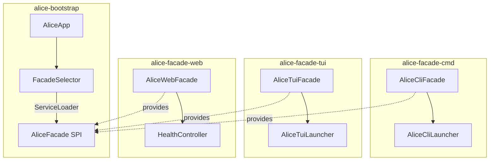

# Alice Agent — Build & Run Guide

## Architecture Overview

Alice Agent uses a **Facade SPI (ServiceLoader)** pattern to decouple the bootstrap
module from specific facade implementations. The `alice-bootstrap` module discovers
facades at runtime via `META-INF/services/org.cland.alice.agent.spi.AliceFacade`.



## Build from Source

### Prerequisites

- **JDK 25+** (Temurin or equivalent)
- **Gradle 9.5** (wrapper provided)

### Build All Modules

```bash
# Full build (compile + check + spotless)
./gradlew build

# Compile only (fast)
./gradlew compileJava

# Clean + compile
./gradlew clean compileJava

# Run all tests
./gradlew check
```

### Build Specific Modules

```bash
# Bootstrap only
./gradlew :alice-bootstrap:compileJava

# CLI facade only
./gradlew :alice-facade-cmd:compileJava

# TUI facade only
./gradlew :alice-facade-tui:compileJava

# Web facade only
./gradlew :alice-facade-web:compileJava
```

---

## Run Facades

All facades are launched through the same bootstrap entry point. The `FacadeSelector`
uses `ServiceLoader` to discover available facades at runtime.

### CLI Mode (default)

```bash
# Run via Gradle
./gradlew :alice-facade-cmd:run

# Or via bootstrap (auto-selects CLI)
./gradlew :alice-bootstrap:run

# With explicit facade flag
./gradlew :alice-bootstrap:run --args="--facade cli"
```

**CLI commands:**

```bash
alice run "What is the capital of France?"
alice run "Write a poem" --model gpt-4o --verbose
alice tools
alice tools --detail
alice config
alice config get default.model
alice config set openai.api_key sk-...
alice chat
alice sub-agent spawn --goal "analyze logs"
```

### TUI Mode

```bash
# Run via bootstrap
./gradlew :alice-bootstrap:run --args="--tui"
# or
./gradlew :alice-bootstrap:run --args="--facade tui"

# Shortcut with -t
./gradlew :alice-bootstrap:run --args="-t"
```

**Windows batch file** (after `installDist`):

```batch
@echo off
chcp 65001 >nul
alice --tui
```

### Web Mode

```bash
# Run via Quarkus dev mode (hot reload)
./gradlew :alice-facade-web:quarkusDev

# Or run as a standalone Quarkus app
./gradlew :alice-facade-web:compileJava
java -jar alice-facade-web/build/libs/alice-facade-web-0.1.0.jar
```

**Web endpoints:**

| Method | Route             | Description      |
|--------|-------------------|------------------|
| GET    | `/api/v1/health`  | Health check     |

---

## Distribution Archives

### Build Installable Distribution

```bash
# Build full distribution (all modules, including bootstrap runtime)
./gradlew :alice-bootstrap:installDist
```

Output: `alice-bootstrap/build/install/alice/bin/alice` (Linux/macOS) or `alice-bootstrap/build/install/alice/bin/alice.bat` (Windows)

### Build Tarball / Zip

```bash
# Cross-platform distribution archives
./gradlew :alice-bootstrap:assembleDist
```

Output:
- `alice-bootstrap/build/distributions/alice-agent-0.1.0.tar`
- `alice-bootstrap/build/distributions/alice-agent-0.1.0.zip`

### Build Individual Module JARs

```bash
./gradlew :alice-facade-cmd:jar     # → alice-facade-cmd/build/libs/alice-facade-cmd-0.1.0.jar
./gradlew :alice-facade-tui:jar     # → alice-facade-tui/build/libs/alice-facade-tui-0.1.0.jar
./gradlew :alice-facade-web:jar     # → alice-facade-web/build/libs/alice-facade-web-0.1.0.jar
```

---

## Facade SPI Details

### How SPI Discovery Works

1. `AliceApp.main()` calls `FacadeSelector.launch(args)`
2. `FacadeSelector` loads all `AliceFacade` implementations via `ServiceLoader`
3. It matches `--facade <name>` (or `--tui` / `--cli` shortcuts) to a facade's `name()`
4. The matched facade's `launch(String[])` is called with filtered arguments

### Service Registration Files

Each facade module provides a file at
`META-INF/services/org.cland.alice.agent.spi.AliceFacade`:

- **alice-facade-cmd**: `org.cland.alice.facade.cmd.AliceCliFacade`
- **alice-facade-tui**: `org.cland.alice.facade.tui.AliceTuiFacade`
- **alice-facade-web**: (to be added when `AliceWebFacade` exists)

JPMS `provides` declarations in each module's `module-info.java`:

```java
// alice-facade-cmd/src/main/java/module-info.java
provides org.cland.alice.agent.spi.AliceFacade
    with org.cland.alice.facade.cmd.AliceCliFacade;

// alice-facade-tui/src/main/java/module-info.java
provides org.cland.alice.agent.spi.AliceFacade
    with org.cland.alice.facade.tui.AliceTuiFacade;
```

### Adding a New Facade

To add a new facade (e.g., `alice-facade-rest`):

1. Create the module with `build.gradle` depending on `project(':alice-bootstrap')`
   (for the SPI interface) and `project(':alice-agent-command')` (for command contracts)
2. Implement `AliceFacade` with a unique `name()` (e.g., `"rest"`)
3. Add `META-INF/services/org.cland.alice.agent.spi.AliceFacade` listing your impl class
4. Declare `provides ... with ...` in `module-info.java`
5. Launch with `alice --facade rest`

**No changes to bootstrap required** — the new facade is auto-discovered at runtime.

---

## Classpath / Module Path Notes

### Runtime Classpath Requirements

For `ServiceLoader` to discover facades, the facade JARs must be on the module path
(or classpath for unnamed modules). The `alice-bootstrap` `build.gradle` no longer
hard-depends on specific facade modules — they must be included at runtime.

When using `./gradlew :alice-bootstrap:run`, only `alice-bootstrap` is on the runtime
classpath. To run with a specific facade, use that facade's `run` task instead:

```bash
# CLI — facade-cmd includes bootstrap transitively
./gradlew :alice-facade-cmd:run

# TUI — facade-tui includes bootstrap transitively
java --module-path alice-bootstrap.jar:alice-facade-tui.jar:... -m alice.agent.app.main/org.cland.alice.agent.AliceApp --tui
```

### Code Formatting

```bash
# Format all Java files (auto-applied during compile)
./gradlew spotlessApply

# Check formatting only (no changes)
./gradlew spotlessCheck
```
