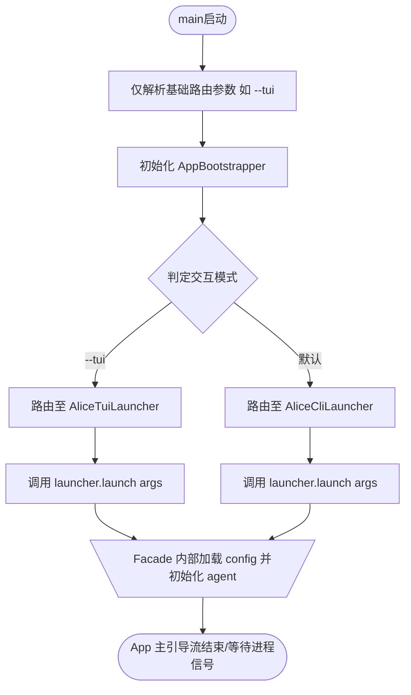
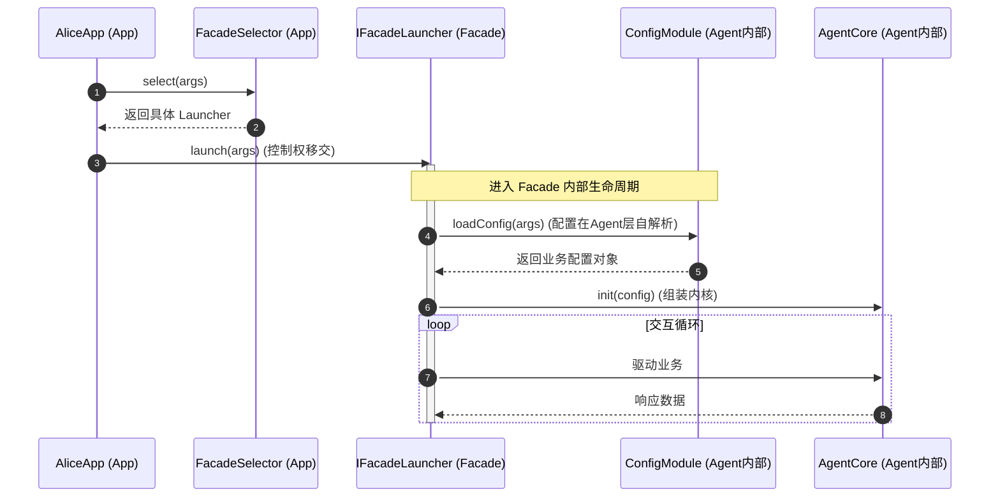

收到，这个调整让架构的职责划分更加清晰了！

`config` 下沉到 `agent` 模块，意味着 **`app` 模块彻底变成了一个纯粹的、无状态的启动外壳（Pure Bootstrapper）**。它现在甚至不需要感知具体的业务配置（如 `application.yaml` 中的 Agent 参数），只需负责最基础的命令行参数解析、选择外壳（Facade），然后把最原始的配置上下文或启动参数像管道一样传递下去，由 `agent` 模块在内核初始化时自行解析和驱动。

基于 **“config 下沉至 agent 模块”** 这一最新变更，我为你同步更新了整体设计文档，进一步弱化了 `app` 对配置的感知。以下是最新版的架构设计文档：

---

title: "alice-app DESIGN"
summary: "App module architecture design - Pure Bootstrapper and Facade Orchestrator"
read_when:

* "understanding bootstrap/facade architecture"
scope:
* "alice-app"
status: "active"
updated: "2026-06-17"

---

# Alice Agent - App 模块架构设计 (Pure Bootstrapper)

本文档定义了重构后的 `app` 模块架构设计。在最新架构中，`config` 模块与核心逻辑一同下沉至 `agent` 模块，`app` 模块进一步退化为 **纯粹的引导程序 (Pure Bootstrapper)**。它不再负责解析具体的业务配置，仅负责 OS/JVM 级初始化、原始命令行参数（Args）解析以及动态调度交互界面 (`facade`)。

---

## 1. 模块关系 (Module Relationships)

`app` 模块作为系统的绝对起点，其依赖和职责极度轻量化：

* **无配置与无内核感知**：不依赖 `config` 逻辑，也不依赖 `alice-core-agent`。`app` 只传递原始的 `args` 或环境变量。
* **界面调度**：仅依赖 `alice-facade-cmd` 和 `alice-facade-tui` 的引导接口，根据基础启动参数（如 `--tui`）决定激活哪个外壳。
* **控制权移交**：完成基础路由后，迅速将主线程控制权和原始参数移交给选定的 Facade 模块，由 Facade 侧配合下沉的 `agent (含 config)` 进行真正的业务装配。

---

## 2. 实体设计 (Entity Design)

### 2.1 核心类图 (Mermaid)

```mermaid
classDiagram
    class AliceApp {
        <<Entry Point>>
        +main(String[] args)
    }

    class AppBootstrapper {
        <<Lifecycle Router>>
        -String[] rawArgs
        +bootstrap() void
    }

    class FacadeSelector {
        <<Utility>>
        +select(String[] args) IFacadeLauncher
    }

    interface IFacadeLauncher {
        <<Interface>>
        +launch(String[] args) void
    }

    %% 外部外壳模块
    class AliceCliLauncher {
        <<alice-facade-cmd>>
        +launch(String[] args) void
    }

    class AliceTuiLauncher {
        <<alice-facade-tui>>
        +launch(String[] args) void
    }

    AliceApp --> AppBootstrapper : 执行入口
    AppBootstrapper --> FacadeSelector : 路由决策
    FacadeSelector ..> IFacadeLauncher : 返回外壳接口
    AliceCliLauncher ..|> IFacadeLauncher
    AliceTuiLauncher ..|> IFacadeLauncher

```

### 2.2 实体说明

* **AliceApp**：JVM 级入口，捕获最基础的系统级信号（如 `Shutdown Hook`）。
* **AppBootstrapper**：轻量级引导器。它不再持有 `RunConfig` 对象，而是直接持有原始的 `String[] args`。
* **FacadeSelector**：仅通过过滤原始参数（例如判断是否包含 `--tui`）来进行外壳路由。
* **IFacadeLauncher**：外壳启动接口，其 `launch` 方法直接接收原始参数 `args`，将配置解析的职责后推。

---

## 3. 业务流程图 (Process Flow)

展示 `app` 模块如何以极短的链路完成引导并退出核心控制流。



---

## 4. 运行动线图 (Sequence Diagram)

展示 `config` 下沉后，业务配置与内核装配完全在 `app` 视线之外完成。



---

## 5. 数据流图 (Data Flow - ASCII)

```
 [ OS / Command Line ]       [ App Module ]             [ Facade / Agent Module ]
          |                        |                               |
          |----- Raw Args -------->|                               |
          |   (--tui / --cli)      |                               |
          |                        |----- Push Raw Args ---------->|
          |                        |                               | (Agent 内部自行解析 config)
          |                        |                               |=======\
          |                        |                               |       | load config
          |                        |                               |<======/
          |                        |                               |
          |<---- Kill / Exit ------|                               |

```

---

### 最新调整总结

1. **职责进一步纯化**：`app` 模块现在对业务逻辑做到了 **“全盲”**，既不知道有 `Agent`，也不知道有 `yaml` 配置。
2. **配置自凝聚**：`config` 随 `agent` 下沉后，Agent 模块变成了自完备的领域（自己定义配置、自己解析配置、自己初始化内核），Facade 模块作为胶水层在中间负责拉通。
3. **高扩展性**：未来如果更换配置中心（如从 `yaml` 换成 `Apollo` 或 `Nacos`），`app` 模块代码完全不需要重新编译或改动。
