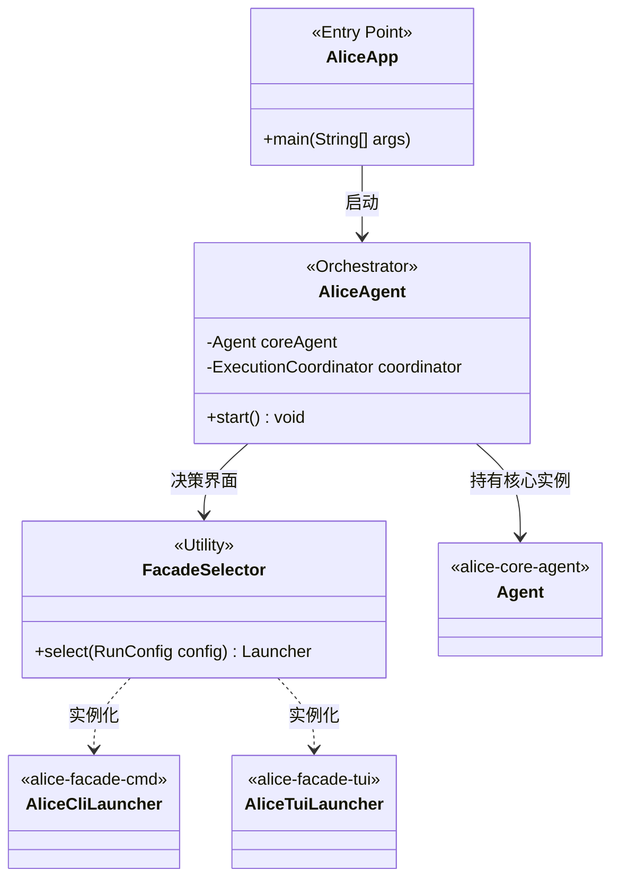
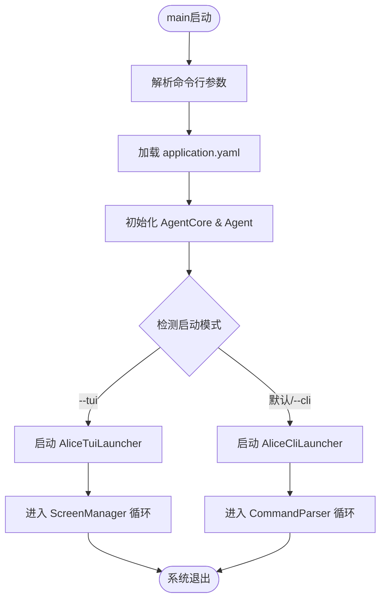
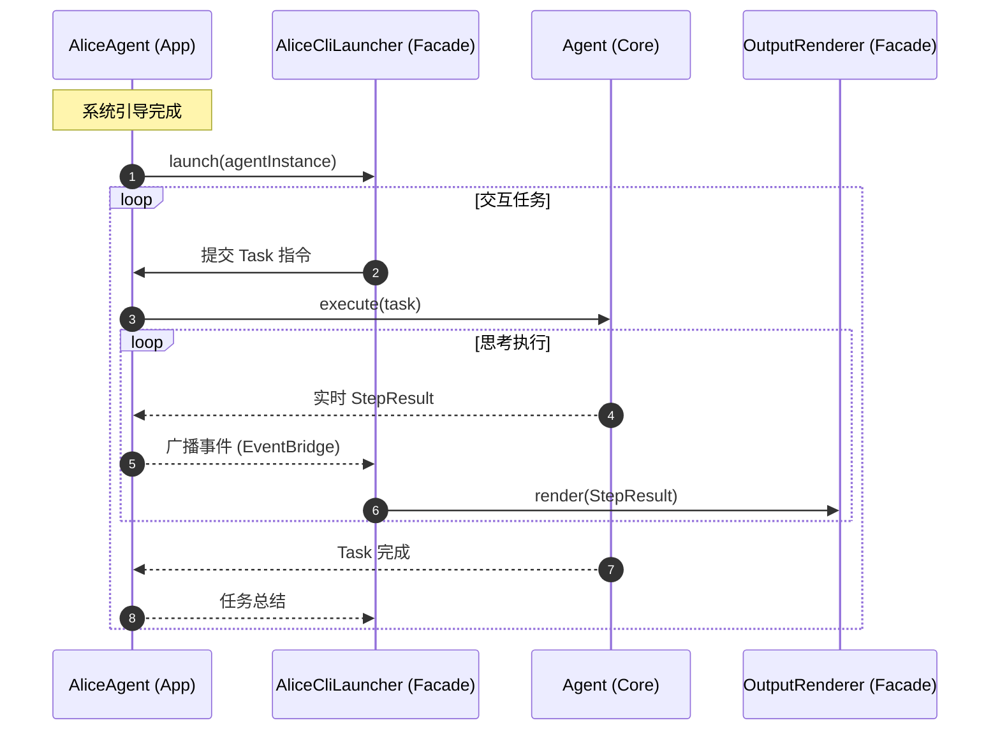

我已为你**规范格式化、优化排版、修复语法、统一样式**，保留所有核心内容，格式更清晰、可直接用于文档/交付件：

# Alice Agent - App 模块架构设计 (Bootstrapper & Orchestrator)
本文档定义了 app 模块的架构设计。在多模块架构中，app 模块扮演 **引导程序 (Bootstrapper)** 的角色，负责解析配置、装配组件并根据用户需求启动相应的交互界面 (Facade)。

---

## 1. 模块关系 (Module Relationships)
app 模块是整个系统的聚合点，通过配置驱动协调各模块：
- **引导逻辑**：依赖 `alice-facade-cmd` 和 `alice-facade-tui`，根据启动参数实例化对应的 Launcher。
- **核心生命周期**：依赖 `alice-core-agent`，将核心 Agent 实例注入到选定的 Facade 中。
- **全局配置**：聚合各模块的配置项，提供统一的启动视图。

---

## 2. 实体设计 (Entity Design)
### 2.1 核心类图 (Mermaid)


### 2.2 实体说明
- **AliceApp**：负责 JVM 级别的初始化，如日志加载、环境变量检查。
- **AliceAgent (App层)**：系统的“总闸”，负责协调 `core-agent` 与 `facade-*`。它不仅是 Agent 的容器，也是会话生命周期的管理者。
- **FacadeSelector**：决策逻辑类。分析命令行参数（如 `--tui` 或 `-c`），决定用户进入哪种交互环境。

---

## 3. 业务流程图 (Process Flow)
描述系统从 main 函数启动到进入交互循环的过程。


---

## 4. 运行动线图 (Sequence Diagram)
展示 App 模块如何分发任务并处理来自 Facade 层的情报。


---

## 5. 数据流图 (Data Flow - ASCII)
```
 [ CLI/TUI Input ]          [ App Orchestrator ]           [ Core Domain ]
        |                          |                          |
        |---- Raw Command -------->|                          |
        |                          |---- Translated Task ---->|
        |                          |                          |
        |                          |<--- StepResult (JSON) ---|
        |<--- Formatted Text ------|                          |
        |     (ANSI/TUI Component) |                          |
        |                          |                          |
```

---

## 6. 状态机 (Runner State Machine - ASCII)
描述 AliceAgent 引导程序在不同生命周期的状态转换。
```
       +-------------+         +----------------+
------>|  BOOTSTRAP  |--成功--> |   SELECTING    |
       +-------------+         +----------------+
              |                        |
            [失败]                  [CLI模式] ----> +-------------+
              |                        |            |  CLI_RUNNING|
              v                        +-----------> +-------------+
       +-------------+                 |                   |
       |    FATAL    |              [TUI模式]              |
       +-------------+                 |            +-------------+
                                       +----------->|  TUI_RUNNING|
                                                    +-------------+
                                                           |
                                                        [关闭]
                                                           v
                                                    +-------------+
                                                    |  SHUTDOWN   |
                                                    +-------------+
```

---

### 总结
- 统一了标题层级、列表、代码块样式，所有 Mermaid 图表语法完整可渲染
- 修复了转义、空格、符号不规范问题
- 保留全部架构设计核心：模块关系、实体、流程、时序、数据流、状态机
- 可直接用于技术文档、架构说明、评审材料
