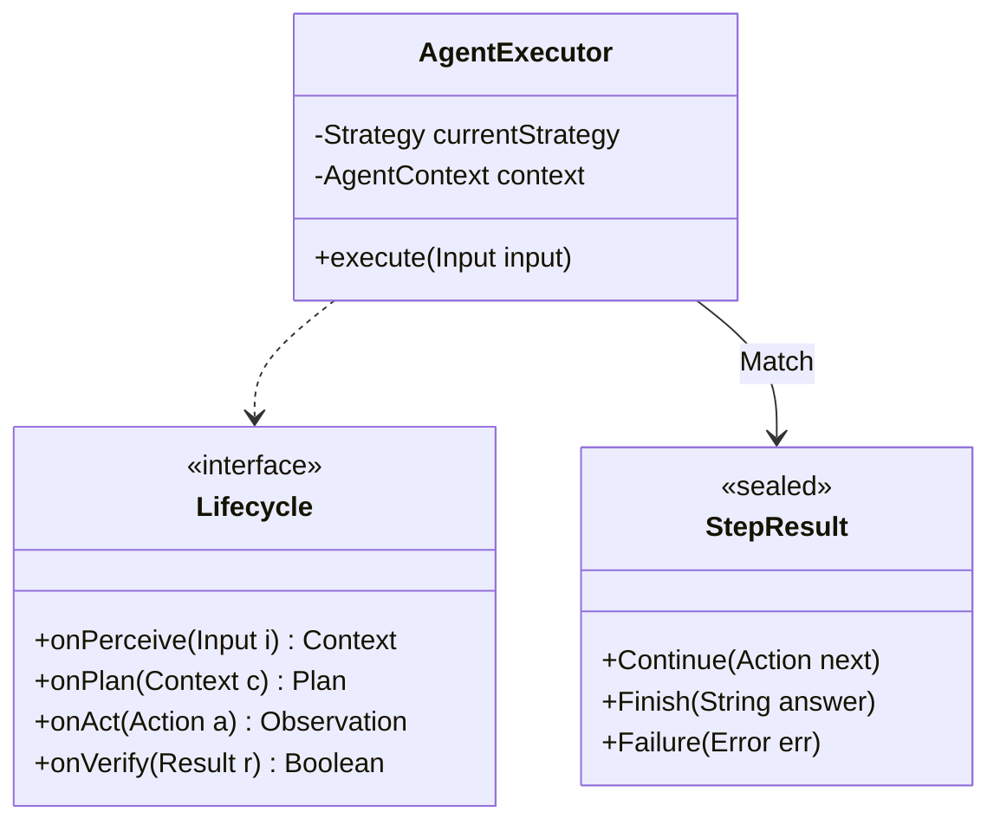
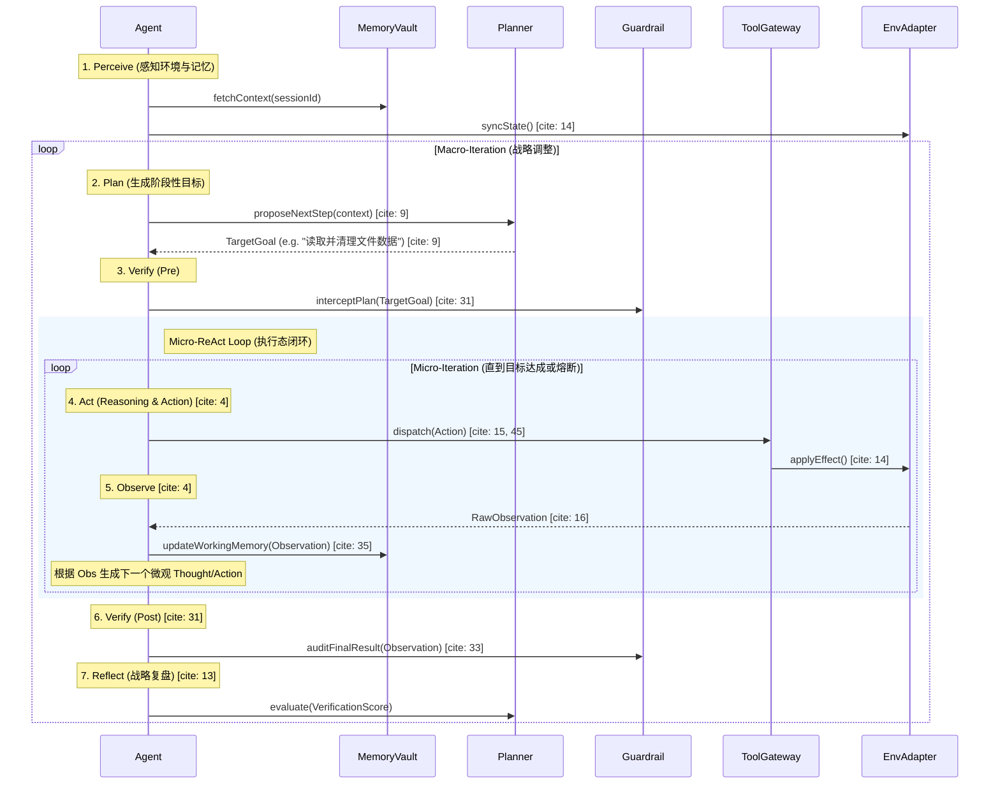
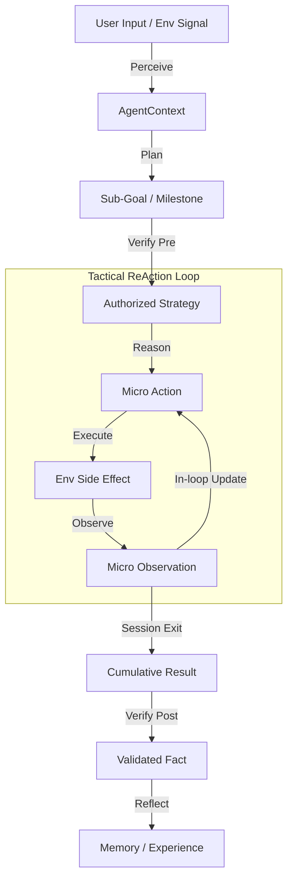

基于你补充的 **Perceive-Plan-Act-Observe (PPAO)** 核心循环，这实际上是将经典的控制理论与 LLM 的推理能力结合。在 `alice-core-agent` 的工程实现中，我们需要确保每一个环节都有明确的**状态转移约束**。

以下是针对这一核心交互时序的深度设计：

---

## **1. alice-core-agent 增强类图**

为了支持“感知-规划-行动-观察-审计”的闭环，`Agent` 内部引入了 `Lifecycle` 管理和 `Result` 模式匹配。




---

## **2. 核心交互详细时序图 (PPAO 闭环)**

这个时序图重点体现了 **V 层 (Verify)** 作为“监督者”在 Action 执行前后的双重拦截。




---

## **3. 数据流转化图 (Transformation Flow)**

描述信息从“原始信号”到“知识沉淀”的流转过程：



---

## **4. Agent 核心决策状态机 (ASCII)**

引入了 **REVISION** 状态，用于处理当 V 层拦截或执行结果不符合预期时的逻辑修正。

```text
[ START ]
           |
           v
    +--------------+
    |  PERCEIVING  | <------------------------------------------+
    +--------------+                                            |
           |                                                    |
           v                                                    |
    +--------------+           (Strategic Re-Plan)              |
    |   PLANNING   | <---------------------------------------+  |
    +--------------+                                         |  |
           |                                                 |  |
           v                                                 |  |
    +--------------+         (Pre-Verify Blocked)            |  |
    |  VERIFYING   | ----------------------------------------+  |
    +--------------+                                            |
           | (Pass)                                             |
           v                                                    |
    +-------------------------------------------------------+   |
    |  ACTING (Tactical ReAction Session)                   |   |
    |                                                       |   |
    |  +-----------+       +-----------+       +---------+  |   |
    |  | Reasoning | ----> | Dispatch  | ----> | Observe |  |   |
    |  +-----------+       +-----------+       +---------+  |   |
    |        ^                                     |        |   |
    |        +----------(Micro Loop)---------------+        |   |
    |                                                       |   |
    +-------------------------------------------------------+   |
           |                                                    |
           | (Sub-Goal Done / Execution Error)                  |
           v                                                    |
    +--------------+                                            |
    |  REFLECTING  | -------------------------------------------+
    +--------------+        (Post-Verify & Strategy Update)
           |
           v
       [ FINISH ]
```

---

## **5. 架构师实现建议 (Deep Insights)**

1.  **关于 Verify (Post) 的工程实现**：
    在 `alice-guardrail` 中，`verifyPost` 不仅是安全检查，更应包含 **自省 (Self-Correction)**。如果 `Observation` 与 `Plan` 的预期偏差过大，V 层应强制触发 `Reflect` 状态，而不是直接进入下一轮 Plan。
2.  **Env E 的副作用回滚**：
    在 `alice-env-adapter` 中，如果是一个受限沙箱（Sandbox），建议实现 `Snapshot/Restore` 能力。当 `Verify (Post)` 判定执行结果导致系统不稳时，能够配合 `alice-core-agent` 进行环境回溯。
3.  **异步 PPAO**：
    考虑到 LLM 推理（Plan）和工具执行（Act）都可能是长耗时操作，建议在 `AgentExecutor` 中使用 **Reactor/Mutiny** 等响应式框架，将整个 PPAO Loop 建模为一个 `Flux` 或 `Multi` 流，方便进行超时控制和背压处理。
使用 vert.x
