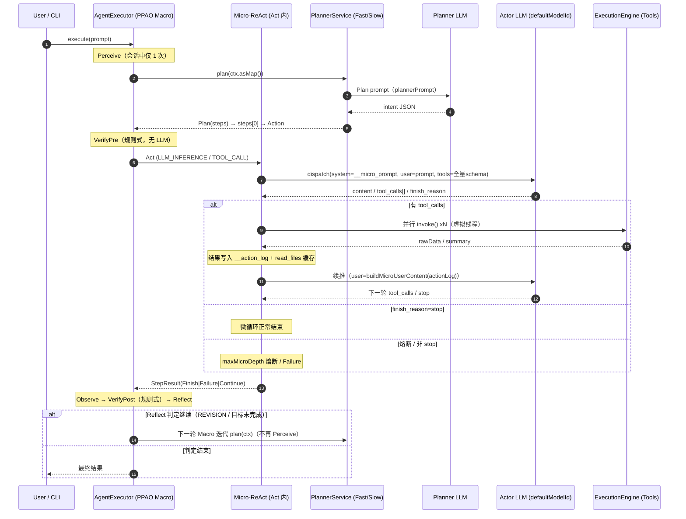

# Loop ↔ LLM Interaction

本文档基于**实际运行代码**（`AgentExecutor` 当前实现，见文末源码索引）绘制 Loop 与 LLM 的交互，
而非 DESIGN.md 的理想形态。与设计的偏差在 [第 7 节](#7-与设计文档的偏差已知问题) 单独标注。

## 1. TL;DR：同一个会话里有两个 LLM 角色

| 角色 | 位置 | 模型 | 职责 | 频次 |
|------|------|------|------|------|
| **LLM#1 Planner** | Macro `Plan` 阶段 → `PlannerService` | `planner.instruction_model_id`(FastPath) / `planner.reasoning_model_id`(SlowPath/MCTS) | 产出战略 intent（不碰工具） | 每 Macro 轮 1 次（SlowPath 内部 MCTS 多次） |
| **LLM#2 Actor** | Micro `Act` 阶段 → `dispatchLlmInference()` | `config.defaultModelId()` | 消费工具结果、决策下一步工具调用 | Micro 内循环，直到 `finish_reason=stop` / 熔断 `maxMicroDepth` |

Guardrail（VerifyPre/VerifyPost）当前是**规则式**实现，不调用 LLM。

## 2. 结构总览（ASCII）

```
                        ┌────────────────────────────────────────────────────────────┐
                        │                      AGENT (alice-core-agent)              │
                        │                                                            │
   user / CLI 输入 ───► │  AgentExecutor.loopBody()  ←─ PPAO Macro Loop (每轮1次 Plan)  │
                        │     │                                                      │
                        │     ▼                                                      │
                        │  ┌───────────────────────────┐   (LLM#1 规划)              │
                        │  │ Macro Plan: PlannerService│──────────► Planner LLM      │
                        │  │  plan(ctx)                │      instruction_model_id   │
                        │  └───────────────────────────┘      FastPath: 1次调用      │
                        │     │  FastPath/SlowPath            SlowPath: MCTS 多轮调用 │
                        │     ▼  Plan → intent → Action                               │
                        │  VerifyPre (规则式 guardrail，无 LLM)                        │
                        │     │                                                      │
                        │     ▼                                                      │
                        │  ┌──────────────────────────────────────────────────┐    │
                        │  │ Act:  Micro-ReAct 战术循环 (microReActStep 递归)   │    │
                        │  │                                                  │    │
                        │  │  Reason: dispatchLlmInference  ◄──── (LLM#2 执行)│    │
                        │  │      model = config.defaultModelId()             │    │
                        │  │      system=__micro_system_prompt                │    │
                        │  │      user  = originalPrompt + __action_log       │    │
                        │  │      tools = ToolRegistry 全量 schema             │    │
                        │  │         │                                         │    │
                        │  │  Dispatch: TOOL_CALL → ExecutionEngine            │    │
                        │  │      (并行: virtual thread 批量)                  │    │
                        │  │         │ 返回 rawData                            │    │
                        │  │  Observe: 结果写回 __action_log                   │    │
                        │  │      └──────────► 再次喂给 LLM#2 (循环)            │    │
                        │  │                                                  │    │
                        │  │  退出: finish_reason=stop / 熔断 maxMicroDepth    │    │
                        │  └──────────────────────────────────────────────────┘    │
                        │     │                                                    │
                        │  Observe(汇总) → VerifyPost(规则审计) → Reflect           │
                        │     │                 ▲                                   │
                        │     └── 判定: REVISION? ─┘   │ FINISH → 终态              │
                        │            │ 下一轮 Macro ───┘ (回到 Plan, 无重新 Perceive)│
                        └────────────┴───────────────────────────────────────────────┘
```

## 3. 典型会话时序（ASCII，按真实调用顺序）

```
 AgentExecutor            PlannerService            LLM#1 规划模型            LLM#2 Actor 模型           Tools/Env
 (PPAO Loop)              (alice-core-planner)      (instruction/reasoning)  (defaultModelId)          (ExecutionEngine)
     │                          │                          │                       │                         │
     │ 1. execute(prompt)        │                          │                       │                         │
     │──Perceive→─────────────►  │                          │                       │                         │
     │ 2. plan(ctx.asMap())      │                          │                       │                         │
     │────────────plan()────────►│                          │                       │                         │
     │                          │ result短路? SOP匹配?      │                       │                         │
     │                          │──StrategySelector────────►│                       │                         │
     │                          │   FastPath: 1次调用       │                       │                         │
     │                          │─────────────────Plan prompt────────►              │                         │
     │                          │◄────────────── intent JSON ────                  │                         │
     │◄─Plan(steps[0]→Action)───│                          │                       │                         │
     │ VerifyPre(规则)           │                          │                       │                         │
     │ 3. Act: Micro-ReAct       │                          │                       │                         │
     │  dispatchLlmInference     │                          │                       │                         │
     │  (首次)                   │                          │        ┌─────────────┤                         │
     │  system=__micro_prompt    │                          │        │ system: buildMicroLoopSystemPrompt│
     │  user=prompt              │                          │        │ user: 原prompt(首次,无actionLog)   │
     │  tools=全量schema         │                          │        │ params: enable_thinking/effort     │
     │──────────────────────────────────────────────────────┼────────►│                             │
     │◄─────────────────────────────────────────────────────┼───────── reasoning_content / content     │
     │                          │                          │        │ tool_calls[] / finish_reason      │
     │  解析 tool_calls          │                          │        └─────────────┤                         │
     │ 4. 并行dispatch(N个)      │                          │                       │                         │
     │────TOOL_CALL xN───────────────────────────────────────►─────────────────────│──────── invoke() ────►
     │◄─────────────────────────────────────────────────────────────────────────────│◄──── rawData/summary──
     │  写 __action_log          │                          │                       │                         │
     │ 5. 续推 actor (递归)      │                          │        ┌─────────────┤                         │
     │  system=__micro_prompt    │                          │        │ user: buildMicroUserContent       │
     │  user=actionLog+readFiles │                          │        │  (tool结果→prompt 重建)            │
     │──────────────────────────────────────────────────────┼────────►│                             │
     │◄────(循环: tool_calls / stop)────────────────────────┼─────────│                             │
     │  finish_reason=stop  ──► 微循环正常结束 = Finish ──► (偏差P1: 直接终态)                        │
     │                          │                          │                       │                         │
     │ Observe → VerifyPost(规则)│                          │                       │                         │
     │ Reflect: 若非 FINISH      │                          │                       │                         │
     │  (Revision 反馈)          │                          │                       │                         │
     │──下一轮 Macro 迭代: plan──►│ (不重新 Perceive/不重新拉环境 — 偏差P5)           │                         │
```

## 4. LLM 触点规格

| # | 触点 | 调用位置 | system | user | tools | 模型 | 频次 / 退出 |
|---|---|---|---|---|---|---|---|
| 1 | Plan (FastPath) | `AgentExecutor.plan()` → `FastPathStrategy.decide()` | planner 侧构造（PromptManager 渲染 planner.ftl 注入 `ctx["plannerPrompt"]`，并写 WAL `plannerPrompt`） | plannerPrompt | 无 | `planner.instruction_model_id` | 每 Macro 轮 1 次；返回 intent JSON（写 WAL `plannerIntent`，traceId 串联） |
| 2 | Plan (SlowPath) | `SlowPathStrategy` + `ThinkingTree` (MCTS) | 同上 | 同上 | 无 | `planner.reasoning_model_id` | MCTS 迭代（Agent.createDefault 默认 mctsIterations=10） |
| 3 | Act 推理 (actor) | `dispatchLlmInference()`（`microReActStep` 内） | `PromptManager.buildMicroLoopSystemPrompt()`，缓存于 `ctx["__micro_system_prompt"]` | 首次 = Action 携带 prompt；续推 = `PromptManager.buildMicroUserContent(actionLog, rawPrompt, readFiles)` | 全量工具 schema（`toolRegistry.allTools()` 动态生成） | `config.defaultModelId()` | Micro 内循环；退出 = `finish_reason=stop`（成功）/ 非 stop（Failure）/ 熔断 `maxMicroDepth`（默认 30） |
| 4 | VerifyPre / VerifyPost | `agent.verifyPre/verifyPost` → `GuardrailVerificatorAdapter` | — | — | — | **无 LLM**（规则式：LogicSanity、PermissionSandbox、HallucinationDetector） | 每 Macro 轮各 1 次 |

工具侧注意点：

- Micro 内**每个 TOOL_CALL** 走 `ExecutionEngine.invoke()`（串行）或虚拟线程并行批；工具结果以 `rawData` 优先、`summary` 兜底，`write_file` 只报成功不回流内容。
- `read_file` 命中 `ctx["__read_files"]`（path→content Map）时直接返回缓存内容，不再执行工具、不回流空占位，避免 LLM 重读循环。
- LLM 调用统一经 `ModelProvider.getInstance().dispatch(...)`；action 参数中 `enable_thinking` / `reasoning_effort` 会原样透传。

## 5. 发送给 LLM 的内容（Payload 明细）

> 本节只描述**真实发出**的消息；构造代码：`PromptManager`（渲染）+ `dispatchLlmInference`（actor）/ `FastPathStrategy.classifyIntent`（planner）。

### 5.1 触点 1 — Planner 分类调用（FastPath，已逐行核实）

`buildPlannerPrompt(ctx)` 渲染 `planner.ftl` 并追加 `buildRules("planner")`（若存在用户规则），得到 `plannerPrompt`；实际发送形态为 `Call.Payload(modelId, plannerPrompt, null, Map.of())` —— **单条 user 消息，无独立 system、无 tools**。

```
<user_task>                                        ← ctx["prompt"] 原始任务
(用户原始需求)
</user_task>
                                                   ← 以下仅存在时渲染（多轮时回填）
[<last_observation> … </last_observation>]        ← ctx["lastObservation"]
[<last_action_result> … </last_action_result>]    ← ctx["lastActionResult"]
[<error> … </error>]                              ← ctx["error"]

<task>Respond with one or more words, space-separated, from the list above.
Example: ANALYZE SEARCH CODE GENERATE</task>   ← 期望输出：纯意图词，非 JSON
[<rules>…</rules>]  ← buildRules("planner") 追加（含意图词表，默认无则省略）
```

- 模型输出被按空格切词匹配 `Intent` 枚举 → 意图链（如 `SEARCH CODE`）；原始响应存入 `plan.metadata.plannerRawResponse`。
- 无法识别 / 调用异常 → 兜底 `ANALYZE`（不回退到慢路径）。
- 与设计文档差异：STORY.md 描述规划输出为"JSON 子目标数组"，实现实为**词分类**（System 1 职责最小化）。

### 5.2 触点 2 — Planner 慢路径（SlowPath / MCTS）

种子 prompt 与 5.1 相同（`plannerPrompt`），由 `MctsEngine` + `ThinkingTree` 对 `planner.reasoning_model_id` 做**多轮**树搜索（默认 mctsIterations=10），树内调用细节见 `docs/alice-core-planner/mcts.md`；最终取 `bestChild` 转 `Plan.Step`。

### 5.3 触点 3 — Actor 推理调用（dispatchLlmInference，已逐行核实）

发送 `messages = [system, user]` + `tools`：

- **system** = `ctx["__micro_system_prompt"]`（`buildMicroLoopSystemPrompt()` 静态缓存一次）：优先 `~/.alice/prompts/micro_loop.ftl`，否则内置 `micro_loop.ftl`。⚠️ 内置版仅为**骨架占位**（`<read_files>` 段含 `path1/path2/…` 示例文本），不含可执行规则；真正的执行规范依赖 `buildRules("micro_loop")` 从用户 rules 注入。
- **user** 分两种形态：

| 轮次 | 内容 | 形态 |
|---|---|---|
| 首次（无工具历史） | Action 参数 `prompt`（来自 Macro plan 的原始任务） | 裸文本，无 XML 包裹 |
| 续推（有工具结果） | `buildMicroUserContent(actionLog, rawPrompt, readFilePaths)` | XML 标签包裹（见下） |

```
<read_files>                                       ← 已读文件路径列表（Map keySet）
src/types.ts
…
</read_files>

<user_task>
(原始任务 rawPrompt)
</user_task>

<tool_result>
(累积工具结果 actionLog："Tool X returned:\n<rawData>\n\n"；
 write_file 仅报 "Tool X succeeded."；
 超过 2000 字符按 \n\n 截断保留尾部)
</tool_result>
```

- **params**：仅透传 Action 参数中出现的 `enable_thinking` / `reasoning_effort`。
- **tools**：每轮附全量 `toolRegistry.allTools()` 生成的 function schema（name/description/parameters），不分层裁剪。
- ⚠️ `buildMicroLoopErrorContent()`（`<tool_error>` 失败恢复模板）当前**无调用者**：工具失败走 `Action.revision` 回 Macro，不进该错误模板。

续推轮次实际 payload 形态示例：

```jsonc
{
  "messages": [
    { "role": "system", "content": "<read_files>…</read_files>…(micro_loop 渲染+rules，含示例占位)" },
    { "role": "user", "content": "<read_files>\nsrc/types.ts\n</read_files>\n\n<user_task>\n帮我写…\n</user_task>\n\n<tool_result>\nTool write_file succeeded.\n\n</tool_result>" }
  ],
  "tools": [ { "type": "function", "function": { "name": "write_file", "description": "…", "parameters": {…} } }, /* …全量 */ ]
  // enable_thinking / reasoning_effort：仅当 Action 携带
}
```

**模型实际看到的速记**：planner 只见 `plannerPrompt`（任务+回填观察+词表指令）；actor 首次只见裸任务（+全量工具 schema），后续每次只见**上一轮工具结果**而非完整历史；两侧的会话历史都不同步回发给模型（WAL 只记录不回放，见 P8）。

## 6. Mermaid 时序图（与实现一致）



## 7. 与设计文档的偏差（已知问题）

| # | 设计（DESIGN.md / STORY.md） | 实现现状 | 影响 |
|---|---|---|---|
| P1 | Micro 完成一个 Goal 后，由 Macro 对照计划仲裁"下一步/结束" | `finish_reason=stop` → `StepResult.Finish` → `verifyPost` 判终 → **整个会话结束**；Macro 只有失败(REVISION)回路，无成功推进回路 | 战略层被架空：双层退化为单层 + 失败重试 |
| P2 | Macro Plan 产出多步子目标并逐轮推进 | `planToIntent()` 只消费 `plan.steps().get(0)`，后续步骤丢弃；每轮重新规划 | 无目标队列/游标可推进（SOP/StaticPlanner chain-list 正在补） |
| P3 | "纯 Macro 模式"应逐 Goal 迭代 | `skipMicro=true` 时 Act 直接返回 Finish，实际一轮即终态 | Macro 循环不迭代 |
| P4 | — | `perceive()` 与每轮 `loopBody` 各 `incrementIteration()` 一次 | `maxIterations=10` 实际完整跑 9 轮 |
| P5 | REVISION 回到 PERCEIVING 重新感知环境/记忆 | REVISION → PLANNING；`perceive()` 只在会话起点跑一次 | 多轮间上下文陈化 |
| P6 | V 层双重拦截含工具级预检/后检 | 宏层规则校验活着；工具级 `GuardrailToolProxy` 全仓库无实例化点，运行时为 null，工具走裸 ExecutionEngine | 工具级守卫（含微循环检测）未生效 |
| P8 | 上下文延续式 | Micro 每轮用 `buildMicroUserContent(rawPrompt+actionLog)` 重建，actionLog>2000 字符截尾；WAL+PromptMelter 未接入微循环 | 长工具链上下文稀释 |

另注：仓库中 Micro-ReAct 逻辑存在**双份拷贝**（`AgentExecutor` 内嵌版为运行版；`MicroReActEngine` + Phase/DispatchStrategy 版为未接线死代码），本文档仅描述运行版。详见 `alice-core-agent/executor/` 目录对比。

## 8. 相关源码索引

| 文件 | 角色 |
|------|------|
| `alice-core-agent/.../executor/AgentExecutor.java` | Macro PPAO 编排 + 内嵌 Micro-ReAct（运行版）；`plan()`、`microReActStep()`、`dispatchLlmInference()`、`dispatchToolCall()`、并行工具批 |
| `alice-core-agent/.../Agent.java` | `createDefault()` 装配 PlannerService（双模型）、Guardrail、Executor；`verifyPre/verifyPost` 委托 |
| `alice-core-agent/.../AgentFacade.java` | 编排层对 Agent 的最小依赖契约 |
| `alice-core-agent/.../prompt/PromptManager.java` | `buildPlannerPrompt` / `buildMicroLoopSystemPrompt` / `buildMicroUserContent` |
| `alice-core-agent/.../guardrail/GuardrailVerificatorAdapter.java` | 规则式 Verificator（LogicSanity / PermissionSandbox / HallucinationDetector），不调 LLM |
| `alice-core-planner/.../PlannerService.java` | 入口：result 短路 → StaticPlanner(SOP) → StrategySelector |
| `alice-core-planner/.../strategy/FastPathStrategy.java` | FastPath：instruction model 单次调用 |
| `alice-core-planner/.../strategy/SlowPathStrategy.java` | SlowPath：reasoning model + ThinkingTree MCTS |
| `alice-core-agent/.../executor/MicroReActEngine.java` | ⚠️ 未接线的第二份 Micro-ReAct 实现（与上表 P-注对应） |

## 9. 补充阅读

- [DESIGN.md](./DESIGN.md) — 核心架构设计（理想形态，含 PPAO 状态机 ASCII）
- [STORY.md](./STORY.md) — PPAO 各节点提示词流（场景叙事版）
- [KEY_LOG.md](./KEY_LOG.md) — AgentExecutor 关键日志标记速查
- [AWL&CheckPoint.md](./AWL&CheckPoint.md) — WAL Safe Point / Checkpoint 状态节点
- [../alice-core-planner/inbound.md](../alice-core-planner/inbound.md) — PlannerService 消费者与决策流
- [../alice-core-planner/DESIGN.md](../alice-core-planner/DESIGN.md) — 双路径决策引擎设计
