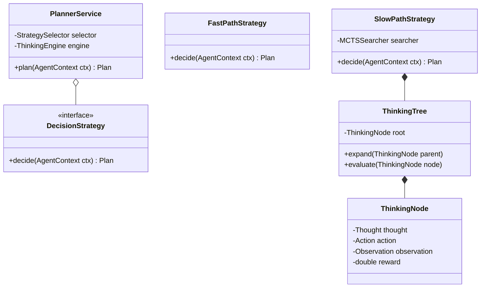
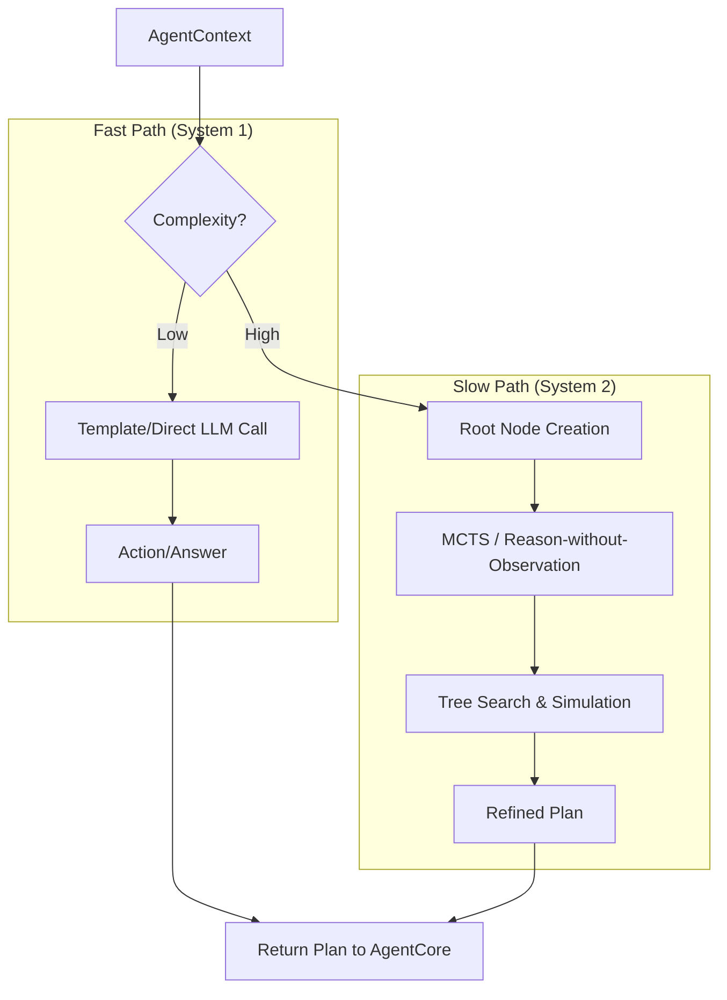

针对 **alice-core-planner** 的设计，核心挑战在于如何将“双路径决策”与 Java 的工程性（强类型、多线程、内存管理）深度结合。这个模块不只是调用 LLM，而是一个**状态化的推理机**。

以下是 alice-core-planner 的深度模块化设计：

---

## **1. 模块类图 (Core Planner Classes)**

设计采用了 **策略模式 (Strategy Pattern)** 来实现双路径决策，并利用 **状态模式 (State Pattern)** 管理思维树。




---

## **2. 双路径决策逻辑流 (Double-Path Logic)**

基于“快慢系统”理论，Planner 在接收输入后首先进行 **复杂度评估 (Complexity Assessment)**。




---

## **3. 核心设计细节 (Engineering Implementation)**

### **3.1 静态规划 (Static Planning) 与 Procedural Memory**
对于 SOP 明确的任务，我们引入 `SopRegistry`。它不仅是字符串匹配，而是利用 **Semantic Router**。
* **实现建议**：使用 `alice-memory-vault` 中的向量索引检索最匹配的流程模板（JSON/YAML）。
* **Java 实现**：`StaticPlanner` 负责将模板直接解析为一系列 `Action` 列表，完全跳过模型生成，保证确定性。

### **3.2 动态规划：MCTS 推理树 (Slow Path)**
在 Java 内存中维护 `ThinkingTree`。每个 `ThinkingNode` 包含：
* **State (S)**：当前的 AgentContext 快照。
* **Action (A)**：规划执行的操作。
* **Value (V)**：模型或验证器给出的该路径得分。
* **工程考量**：利用 `java.util.concurrent.ForkJoinPool` 并行评估多个推理分支，加快 MCTS 的模拟（Simulation）阶段。

### **3.3 模型抽象层 (Model Supplier API)**
为了实现 **LLM Agnostic**，Planner 并不直接持有 OpenAI 或 Ollama 的客户端，而是持有 `ModelCapabilities`：
```java
public interface ModelSupplier {
    // 高性能模型用于复杂推理 (System 2)
    ModelSession getReasoningModel(); 
    // 轻量模型用于快速分类或简单指令 (System 1)
    ModelSession getInstructionModel(); 
}
```

---

## **4. 决策状态机 (ASCII Text)**

描述 Planner 内部从“接收意图”到“交付路径”的过程：

```text
       [ RECEIVE CONTEXT ]
               |
               v
      /-----------------\
     |  STRATEGY ROUTER  |
      \-------+---------/
              |
      +-------+-------+
      |               |
[ FAST PATH ]   [ SLOW PATH ]
      |               |
      |        (TREE EXPANSION) <-----+
      |               |               |
      |        (SIMULATION/VAL) ------+
      |               |
      +-------+-------+
              |
              v
      [ PLAN REFINEMENT ]
              |
      [ EMIT NEXT STEP ]
```

---

## **5. 针对 alice-core-planner 的后续开发建议**

* **Token 熔断机制**：在 Slow Path 的 MCTS 搜索中，必须设置 `TokenBudget`。当搜索深度或消耗超过阈值时，强制回退到当前最优分支。
* **序列化能力**：`ThinkingTree` 应该支持序列化到 `alice-memory-vault`。这样当用户中途打断对话时，Agent 在下次唤醒后可以从上次的“思维断点”继续搜索，而不是重新开始。
* **多模型混部方案**：
    * **Router**: 使用轻量化的模型（如 Qwen-1.8B 或 Llama-3-8B）做复杂度判定。
    * **Slow Path**: 使用 DeepSeek-V3 或 GPT-4o 做 MCTS 的 Node 节点生成。
    * **Fast Path**: 直接透传。

这个设计目标将 Planner 从一个简单的“提示词包装器”提升为了一个真正的**具有元认知能力（Metacognition）**的工程模块。
