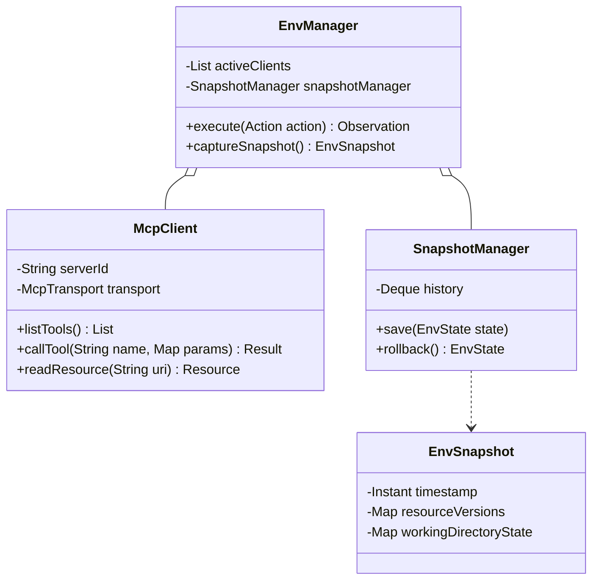
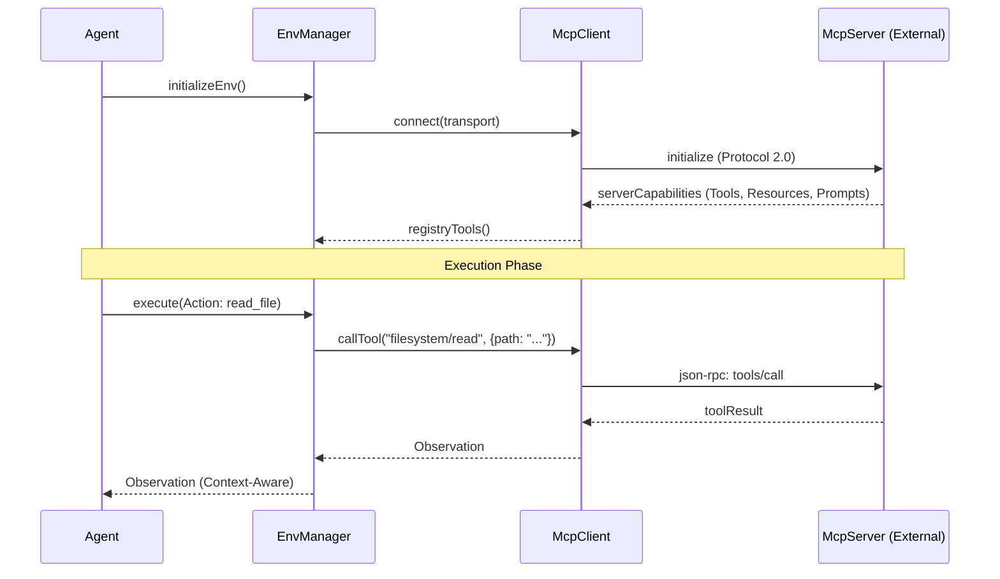
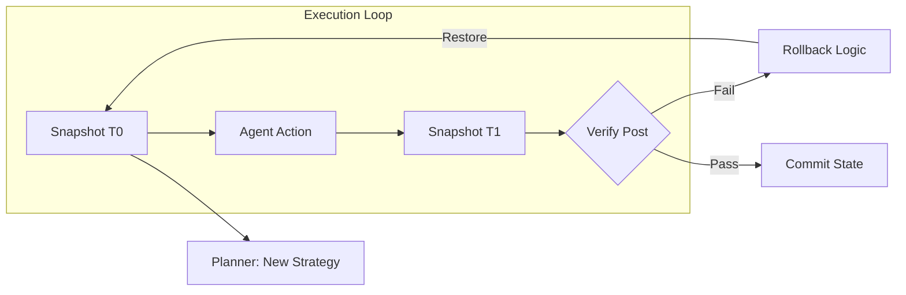

针对 **alice-env-adapter** 的设计，核心在于将"外部世界"抽象为一个可观察、可操作且可回滚的**状态机**。通过原生支持 MCP 2.0，我们让 Agent 具备了工业级的连接能力。

---

## **1. 模块类图 (Core Environment Classes)**

设计重点在于 `McpClientConnector` 的协议实现以及 `EnvSnapshotter` 的状态管理。




---

## **2. MCP 2.0 交互时序图 (Protocol Flow)**

展示 Agent 如何作为 MCP Client 与外部 Server（如 Filesystem, Database, GitHub）进行双向握手与能力调用。




---

## **3. 上下文感知与回滚机制 (State Flow)**

当 `alice-core-planner` 判定当前路径失败时，`EnvManager` 负责协调"环境坍缩"到上一个稳定快照。



---

## **4. 核心工程实现细节**

### **4.1 MCP 2.0 协议栈实现**
* **Transport 层**：支持 `Stdio` (用于本地 Python/Node 工具) 和 `SSE` (Server-Sent Events，用于远程服务)。
* **资源订阅 (Resources)**：利用 MCP 2.0 的订阅机制，当外部资源（如日志文件、数据库表）发生变化时，`EnvManager` 能够主动向 `AgentCore` 发送通知（Environment Event）。

### **4.2 上下文快照 (Env Snapshot)**
由于完全的物理回滚（如数据库 Delete）代价很高，`alice-env-adapter` 采用 **"虚实结合"** 的策略：
* **轻量级属性**：记录当前 Working Directory 的文件列表、环境变量、已加载的资源 URI。
* **物理回滚 (Sandbox Only)**：如果 Action 在 Docker/Wasm 沙箱中执行，支持容器层的 `Checkpoint/Restore`。
* **逻辑补偿**：对于无法物理回滚的操作（如发送了邮件），在快照中标记为"已产生不可逆副作用"，告知 Planner 只能通过补偿 Action（如发送撤回邮件）来修正。

---

## **5. 环境状态机 (ASCII)**

```text
       [ DISCONNECTED ]
              |
              v (Connect / Handshake)
       [ INITIALIZING ]
              |
              v (Capability Discovery)
   +----[ READY / IDLE ] <----------------+
   |          |                           |
   |          v (Action Triggered)        |
   |   [ CAPTURING SNAPSHOT ]             |
   |          |                           |
   |          v                           |
   |   [ EXECUTING (MCP) ]                |
   |          |                           |
   |          +---- (Success) ----> [ AUDITING ]
   |          |                        |
   |          +---- (Error/Abort) -+   | (Pass)
   |                               |   v
   +---- [ ROLLING BACK ] <--- (Fail) -+---- [ COMMITTED ]
```

---

## **6. 架构师实现建议**

1.  **资源发现协议**：利用 `alice-tool-gateway` 自动扫描 MCP Server 暴露的 `tools/list`，并动态生成 Java 代理方法，实现 Planner 的零成本集成。
2.  **多租户隔离**：由于你定位为"一人公司"，虽然目前可能是单用户，但建议在 `EnvManager` 中预留 `Namespace` 概念，防止不同任务间的环境污染（例如：开发任务的文件流不应干扰财务任务的上下文）。
3.  **零拷贝 Observation**：针对大文件读取，`McpClient` 应支持流式处理（Streaming），避免将数兆的上下文直接塞进 JVM Heap，造成 OOM。
