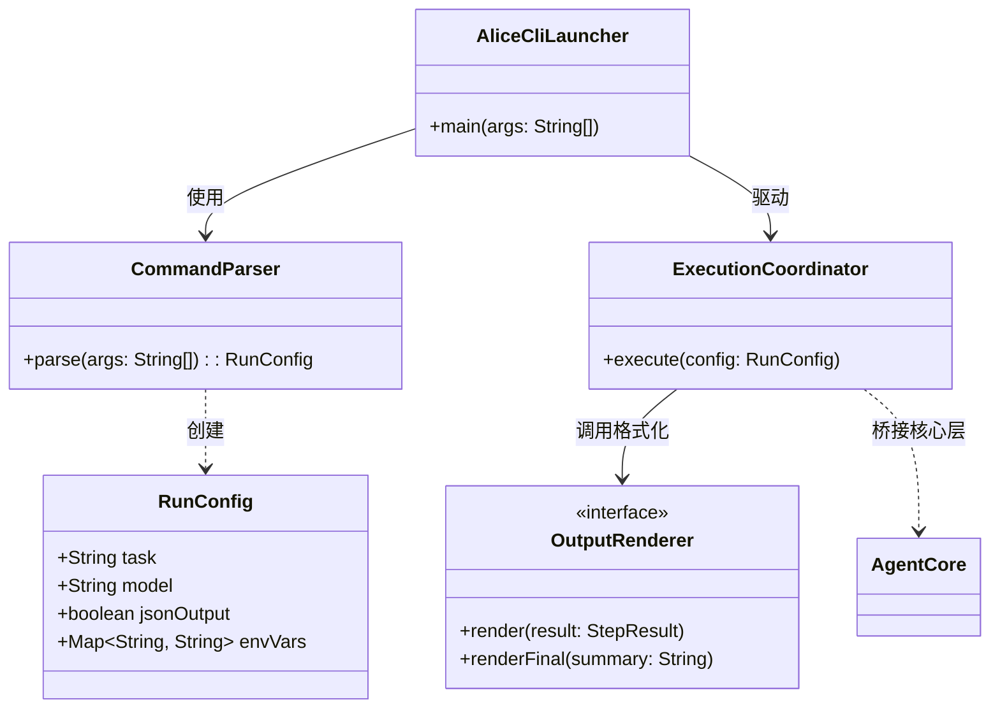
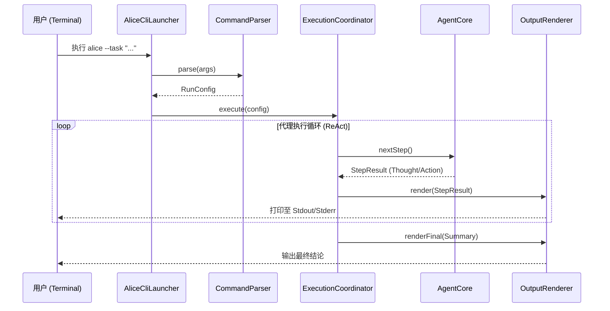
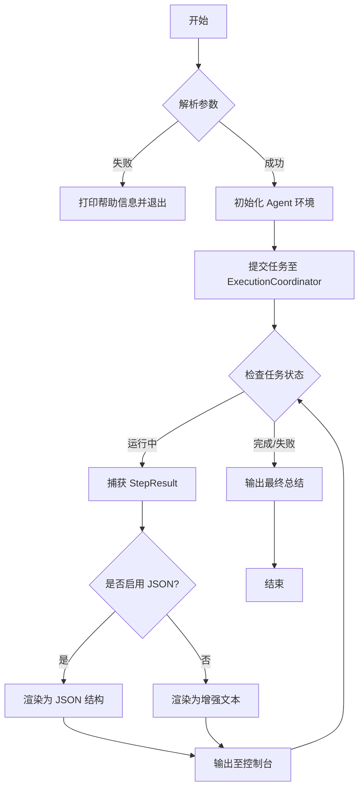

# alice-facade-cmd 设计文档
## 目录
1. 模块概述
2. 实体关系图
3. 时序图
4. 业务流程图
5. 数据流图
6. 状态机
7. 功能用例与命令设计
8. 模块实现细节

---

## 1. 模块概述
`alice-facade-cmd` 是 Alice Agent 的**命令行界面外观模块**，核心职责：
- 解析 CLI 命令参数
- 启动 Alice 核心代理
- 将执行过程、结果以**纯文本/JSON**结构化输出至标准输出流

---

## 2. 实体关系图 (Entity Diagram)
展示 CLI 模块内部组件与核心层的关联关系。


---

## 3. 时序图 (Sequence Diagram)
展示**用户输入命令 → 任务执行完成**的完整生命周期。


---

## 4. 业务流程图 (Flowchart)
描述 CLI 执行全流程的逻辑判定与分支。


---

## 5. 数据流图 (Data Flow Diagram)
展示数据在各模块间的流动与转化。
```
+----------+        +----------------+        +------------------+
|  User    |  args  |                | config |                  |
|  Input   +------->| CommandParser  +------->| Execution        |
| (String) |        |                |        | Coordinator      |
+----------+        +----------------+        +--------+---------+
                                                     |
                                                     v
+----------+        +----------------+        +------------------+
| Terminal |  text  |                | result |                  |
|  Stdout  |<-------+ OutputRenderer |<-------+   AgentCore      |
|  /Stderr |        |                |        | (alice-core)     |
+----------+        +----------------+        +------------------+
```

---

## 6. 状态机 (State Machine)
描述 CLI 进程的生命周期与状态转换。
```
       +---------+          +----------+          +-----------+
------>|  INIT   |----+---->| PARSING  |----+---->|  RUNNING  |
       +---------+    |     +----------+    |     +-----+-----+
                      |           |         |           |
                      v           v         v           |
                  +-------+   +-------+  +-------+      |
                  | ERROR |<--| FATAL |<--| TIMEOUT |<----+
                  +-------+   +-------+  +-------+      |
                                                        |
                                          +-------------+-------------+
                                          |                           |
                                          v                           v
                                   +------------+              +------------+
                                   | SUCCESSFUL |              |   FAILED   |
                                   +------------+              +------------+
```

---

## 7. 功能用例与命令设计
### 7.1 核心命令集
| 命令 | 说明 | 示例 |
| :--- | :--- | :--- |
| `alice run` | 执行单次任务并退出 | `alice run "清理当前目录的日志文件"` |
| `alice chat` | 开启交互式对话（支持 Session） | `alice chat --session-id "dev-123"` |
| `alice tools` | 列出所有加载工具及描述 | `alice tools --detail` |
| `alice config` | 管理模型密钥/全局配置 | `alice config set openai.key "sk-..."` |

### 7.2 参数详情（以 run 为例）
- `-t, --task <string>`：**必填**，指定 Agent 任务目标
- `-m, --model <string>`：可选，覆盖默认模型（如 gpt-4o、claude-3.5-sonnet）
- `-v, --verbose`：可选，打印详细思考/执行过程
- `--json`：可选，以 JSON 格式输出结果
- `--timeout <int>`：可选，设置任务最大执行时长（秒）

### 7.3 典型使用场景
#### 用例 1：开发者自动化
- 描述：CLI 快速生成单元测试
- 命令：`alice run "为 src/main/java/Utils.java 生成单元测试" --verbose`
- 预期输出：实时展示文件读取、逻辑思考、工具调用过程，最终输出测试文件路径

#### 用例 2：系统管理
- 描述：查询端口占用情况
- 命令：`alice run "找出占用 8080 端口的进程并显示详细信息"`
- 预期输出：调用系统命令，返回目标进程列表

#### 用例 3：管道集成（CI/CD）
- 描述：日志自动化分析
- 命令：`cat build.log | alice run "分析此日志中的错误原因" --json`
- 预期输出：结构化 JSON（包含 error_code、reason、suggestion 等字段）

---

## 8. 模块实现细节
1. **依赖框架**：推荐使用 `picocli` 处理子命令与参数解析
2. **退出码映射**
    - `0`：任务执行成功
    - `1`：运行时错误（Agent 无法完成目标）
    - `2`：命令参数错误
    - `130`：用户手动中断（Ctrl+C）

### 总结
1. 本文档完整规范了 `alice-facade-cmd` 模块的**架构、流程、命令、实现**标准
2. 所有图表统一格式，结构清晰，可直接用于开发、评审与维护
3. 聚焦 CLI 核心能力：参数解析、代理驱动、结构化输出，兼容交互式/自动化场景
