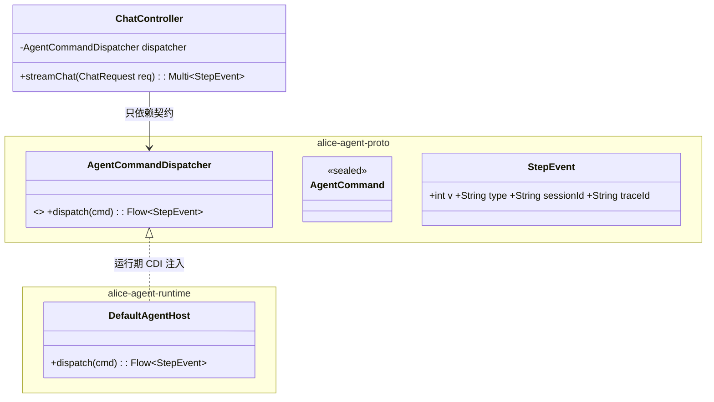
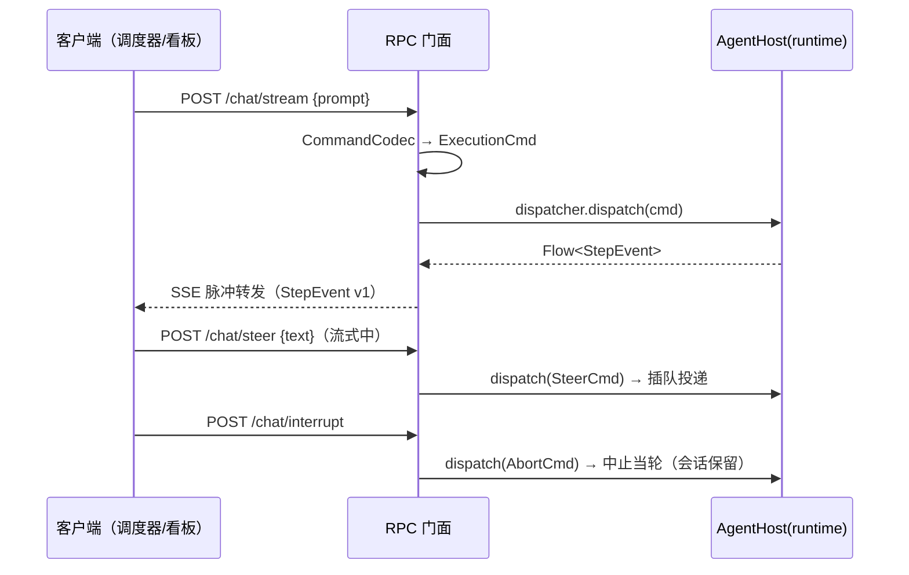

# alice-facade-rpc 设计文档（HTTP RPC 2.0）

> **2026-09-19 更名与定位修正**：原名 `alice-facade-web` —— 它**不是 Web UI 门面**，而是**协议适配层**
> （面向程序），即 HTTP RPC 2.0。命名与依赖同时修正：只依赖 `alice-agent-proto` 契约，
> 运行期注入 `AgentCommandDispatcher`（实现由 `alice-agent-runtime` 提供），**禁止依赖 `alice-core-agent`**。
> 工作项见 `docs/release/20260919/协议层转正与门面收敛-清单.md`（C1）。

---

## 1. 模块定位与边界

- **属于**：协议/传输适配层（协议轴 × HTTP 传输）；面向**程序**（调度器/看板/CI/其他 agent），不面向人类阅读；
- **职责**：HTTP/SSE 编解码 + 路由 + 鉴权 + 错误码映射；**不承担**任何会话状态、轮次语义、持久化；
- **无状态**：会话/单写者/一轮一锁/超时 abort 全在 `alice-agent-runtime`（宿主）；本模块挂了不影响会话（重连即可）。

## 2. 依赖拓扑（依赖倒置）



- **编译期**：仅 `alice-agent-proto`（命令/事件/端口/codec）；
- **运行期**：`alice-agent-runtime` 提供 `AgentCommandDispatcher` 实现（`AgentHost`）；注入方式由组合根决定（MVP：构造函数传入；后续可接 DI）；
- **禁止**：`alice-core-agent`（core 只被 runtime 依赖）。

## 3. 接口 v1（路由表）

| 方法 | 路由 | 映射命令 | 说明 |
|---|---|---|---|
| POST | `/api/v1/session` | `ResetSessionCmd` / `ResumeSessionCmd` | 新建（默认）/ 显式续接会话 |
| POST | `/api/v1/chat/stream` | `ExecutionCmd`（prompt） | 一轮任务；响应 `text/event-stream`（SSE） |
| POST | `/api/v1/chat/steer` | `SteerCmd` | **人工插话**：忙时插队（当前工具跑完后、下一次 LLM 调用前投递） |
| POST | `/api/v1/chat/interrupt` | `AbortCmd` | 中止当前轮（**会话保留**，与"退出"不同） |
| GET | `/api/v1/health` | 查询（非命令） | 会话名 / 流式状态 / 最后一轮摘要 / usage / stderr 摘要 |

### 3.1 请求/响应示例

**请求体 = 协议 v1 命令信封（与 stdio 同构，禁止自定义 DTO）**：

```jsonc
// POST /api/v1/chat/stream
{"v":1,"type":"prompt","sessionId":"sess-01","traceId":"t-1","payload":{"message":"ping"}}
// → 200 text/event-stream（每帧一个 StepEvent v1）
data: {"v":1,"type":"THOUGHT","sessionId":"sess-01","traceId":"t-1","seq":0,"ts":"…","payload":{…}}
data: {"v":1,"type":"SUMMARY","seq":1,"payload":{"text":"pong"}}
data: {"v":1,"type":"DONE","seq":2,"usage":{"totalTokens":0,"cost":0.0}}

// POST /api/v1/chat/steer      → 202 {"ok":true,"queued":true}
// POST /api/v1/chat/interrupt  → 200 {"ok":true}
// GET  /api/v1/health          → 200 {"ok":true,"sessionId":"…","roundActive":false,"rounds":1,…}
```

**帧规范唯一真源**：`docs/alice-agent-proto/PROTOCOL.md`（本模块不得自定义 JSON 结构，编解码调 proto 的 `codec`）。

## 4. 关键时序



## 5. 错误映射

| 情形 | HTTP | 说明 |
|---|---|---|
| 字段校验失败（`CommandValidationException`） | 400 | 请求体错误 |
| 未鉴权 | 401 | 生产部署启用（本机回环可关） |
| 会话不存在 | 404 | `sessionId` 查无 |
| **并发一轮（busy）** | **409** | 客户端应等当前轮或改走 `/chat/steer` |
| 宿主执行失败/超时 | 500 / 504 | 超时前宿主已发 `AbortCmd`（会话保留） |
| 宿主未就绪（runtime 未注入） | 503 | 熔断，客户端重试/自愈 |

## 6. 与 `docs/pi-integration/worker-http.md` 的对照（同一契约的两种传输）

| worker-http（本机回环、调度器用） | 本模块（HTTP RPC 2.0、对客/多客户端） |
|---|---|
| `POST /prompt` 同步等一轮 | `POST /chat/stream` SSE 流式 |
| `POST /steer` | `POST /chat/steer`（同一 `SteerCmd`） |
| `POST /abort` / `/new_session` | `POST /chat/interrupt` / `/api/v1/session` |
| `GET /health` | `GET /api/v1/health` |
| 无鉴权（127.0.0.1） | 鉴权/多租户（部署策略决定） |

> 两者帧与语义**同源**（proto + runtime），差别只在传输与部署形态。

## 7. 非目标

- 不做 UI/页面/静态资源（Web UI 若做，属 UI 适配层另一个门面）；
- 不做会话持久化与状态（含 WAL）——归 runtime/core；
- 不做协议扩展（新命令/新事件先进 `alice-agent-proto` 并按版本纪律演进）。
