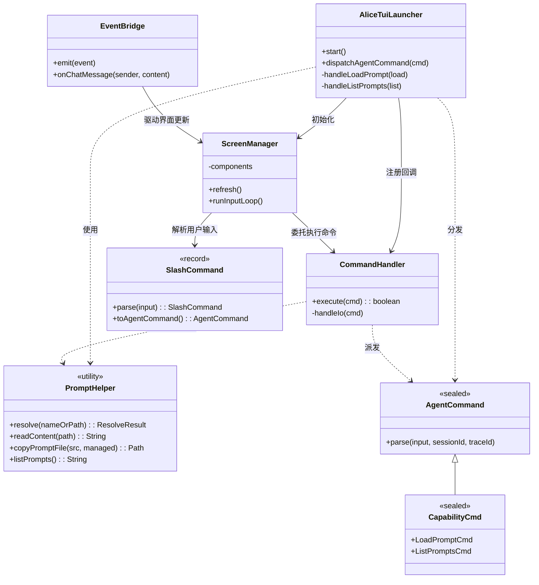
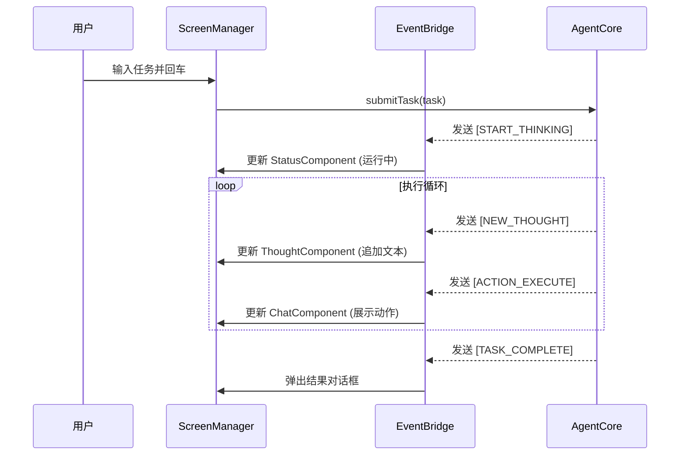
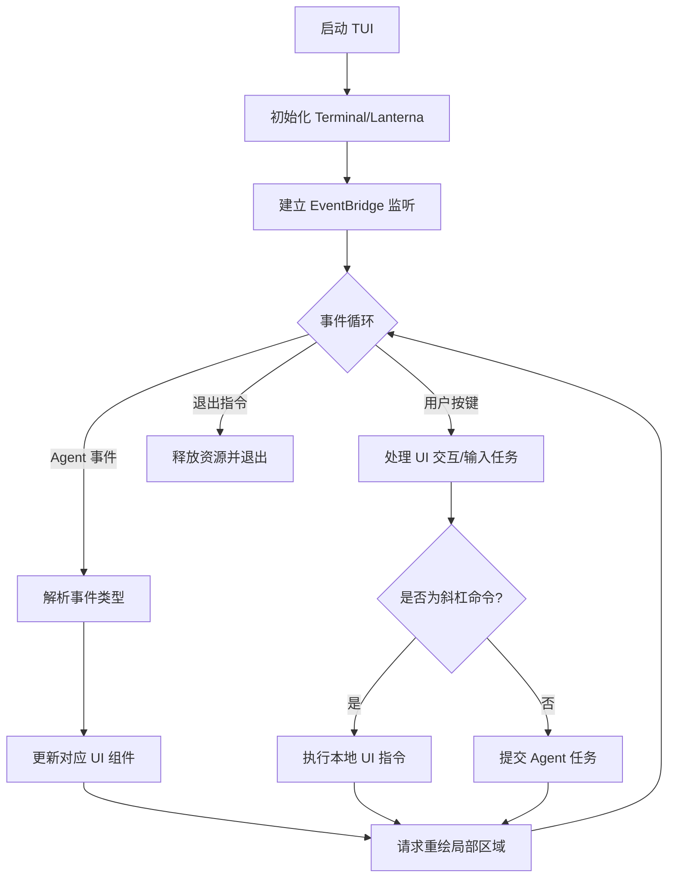

# alice-facade-tui 设计文档
## 目录
1. 模块概述
2. 实体关系图
3. 时序图
4. 业务流程图
5. 数据流图
6. 状态机
7. 功能用例与 TUI 布局
8. AgentCommand 分发
9. Managed Prompts 系统
10. 模块实现细节

---

## 1. 模块概述
`alice-facade-tui` 是 Alice Agent 的**终端用户界面（TUI）外观模块**，核心定位：
- 提供**富交互、可视化**的任务监控面板
- 实时展示 Agent **思考链（Thought Stream）**、执行日志
- 支持**交互式任务提交**、快捷命令、状态监控

---

## 2. 实体关系图 (Entity Diagram)
展示 TUI 内部组件、AgentCommand 分发体系、Prompt 管理工具的关联关系。


---

## 3. 时序图 (Sequence Diagram)
展示 TUI **异步处理 Agent 事件 + 实时界面更新**的完整流程。


---

## 4. 业务流程图 (Flowchart)
描述 TUI **主事件循环 + 交互逻辑**。


---

## 5. 数据流图 (Data Flow Diagram)
展示 TUI 中**用户输入 → 核心处理 → 界面渲染**的异步数据流。
```
+----------------+      +----------------+      +------------------+
| User Keyboard  | Key  | ScreenManager  | Task |                  |
| (Input Area)   +----->| (Input Buf)    +----->|   AgentCore      |
+----------------+      +-------^--------+      +---------+--------+
                                |                         |
                                |                         | Event
        +----------------+      |       +-----------------v+
        |   Renderer     |      |       |   EventBridge    |
        | (Pixel/Char)   |      +-------+ (Message Queue)  |
        +-------+--------+              +------------------+
                |
                v
        +----------------+
        |   Terminal     |
        | (Display Grid) |
        +----------------+
```

---

## 6. 状态机 (State Machine)
描述 TUI 界面随 Agent 执行阶段的**状态转换**。
```
       +---------+          +----------+          +------------+
------>|  IDLE   |----+---->| INPUTING |----+---->|  RUNNING   |
       | (空闲)  |    |     | (输入中) |    |     | (思考执行) |
       +----^----+    |     +----------+    |     +-----+------+
            |         |                     |           |
            |         v                     v           |
            |    +---------+          +----------+      |
            +----+  ERROR  |<---------+ INTERVENE|<-----+
                 | (报错)  |          | (人工干预)|
                 +---------+          +----------+
```

---

## 7. 功能用例与 TUI 布局
### 7.1 界面布局设计 (Layout)
see [Layout.md](./Layout.md)

### 7.3 斜杠命令设计 (Slash Commands)
输入框以 `/` 开头触发快捷指令，由 TUI 拦截处理。所有命令统一通过 `AgentCommand.parse()` 解析为密封指令记录。

| 斜杠命令 | AgentCommand 类型 | 说明 |
| :--- | :--- | :--- |
| `/new` | `ControlCmd.ResetSessionCmd` | 重置会话：清空上下文，开启新对话 |
| `/clear` | `ControlCmd.ClearContextCmd` | 清屏：仅清空 UI 显示内容 |
| `/context` | `ControlCmd.ViewContextCmd` | 查看上下文：展示 Token 占用与消息快照 |
| `/compact` | `ControlCmd.CompactContextCmd` | 压缩上下文：提炼历史为摘要，释放 Context Window |
| `/feedback <msg>` | `ControlCmd.FeedbackCmd` | 反馈：向 Agent 注入人类反馈（HITL） |
| `/exit` | `ControlCmd.InterruptCmd` | 安全退出：保存会话后关闭 TUI |
| `/help` | (UI only) | 命令帮助：列出所有斜杠命令 |
| `/prompt:<name>` | `CapabilityCmd.LoadPromptCmd` | 加载 managed prompt：从 `~/.alice/prompts/` 按名称加载 |
| `/prompt <path>` | `CapabilityCmd.LoadPromptCmd` | 加载外部提示词文件作为系统提示 |
| `/prompt` | `CapabilityCmd.ListPromptsCmd` | 列出所有可用 managed prompts |
| `/rules <ref>` | `CapabilityCmd.UpdateRulesCmd` | 加载规则引用 |
| `/skill <ref>` | `CapabilityCmd.RegisterSkillCmd` | 注册 MCP/工具集 |
| `/reload` | `CapabilityCmd.ReloadKernelCmd` | 热重载所有能力源 |
| `/history` | (UI only) | 历史回溯：展示最近执行记录快照 |
| `/exec <cmd>` | `ExecutionCmd.ExecuteRawCmd` | 执行指令：运行 Shell 命令并将结果传给 Agent |
| `/model <id>` | `AlignmentCmd.SwitchModelCmd` | 切换模型：动态修改当前使用 LLM |
| `/tools` | (UI only) | 查看工具：列出 Agent 可用工具集 |
| `/routine <cron>` | `RoutineTimeCmd.RegisterRoutineCmd` | 注册定时任务 |
| `/sub-agent <sub>` | `SubAgentCmd.*` | 子 Agent 管理 |
| `/resume [id]` | `ControlCmd.ResumeSessionCmd` | 继续历史会话 |

### 7.3a 冒号语法 (Colon Syntax)
`/prompt:<name>` 使用冒号语法，解析器在检测到命令名包含 `:` 时自动拆分：
- `/prompt:code-review` → cmd=`/prompt`, args=`code-review`
- 支持 Tab 补全：输入 `/prompt:` 后按 Tab 动态扫描 `~/.alice/prompts/*.ftl` 列出匹配的 prompt 名称

### 7.3b Managed Prompts 系统
Managed prompts 是存储在 `~/.alice/prompts/` 下的 `.ftl` 文件，可由任何 facade 加载：
- **存放位置**：`~/.alice/prompts/<name>.ftl`
- **加载方式**：`/prompt:<name>` 或通过 `PromptHelper.resolve()` API
- **Tab 补全**：TUI 模式下输入 `/prompt:` 后按 Tab 自动扫描并补全 prompt 名称
- **注册流程**：resolve → readContent → copyPromptFile → PromptManager.reloadFromDisk()
- **无参数**：单独输入 `/prompt` 列出所有可用的 managed prompts

### 7.4 典型使用场景
1. **加载 Managed Prompt**
   - 用户输入：`/prompt:code-review`
   - TUI 从 `~/.alice/prompts/code-review.ftl` 加载提示词，注入 Agent system prompt

2. **引导式开发**
   - 用户输入：`/prompt ./standard_coding_style.md`
   - TUI 加载外部规范文件，通知 Agent 按规范生成代码

3. **环境感知协作**
   - 用户输入：`/exec netstat -ano | grep 8080`
   - TUI 将命令输出作为上下文，Agent 自动分析端口占用并给出建议

4. **快速重置**
   - Agent 陷入死循环时，输入 `/new` 快速重置对话环境

---

## 8. AgentCommand 分发

### 8.1 dispatchAgentCommand 路由
`AliceTuiLauncher.dispatchAgentCommand()` 使用 Java 21 模式匹配 `switch` 分发：

```java
switch (cmd) {
  case ExecutionCmd.AcquireGoalCmd run  -> submitTaskToAgent(run.task());
  case ExecutionCmd.ExecuteRawCmd exec  -> submitTaskToAgent(exec.task());
  case CapabilityCmd.LoadPromptCmd load -> handleLoadPrompt(load);   // /prompt
  case CapabilityCmd.ListPromptsCmd list -> handleListPrompts(list);  // /prompt (no args)
  case CapabilityCmd.ReloadKernelCmd r  -> handleReload(r);
  case ControlCmd.ResetSessionCmd reset -> handleReset(reset);
  case ControlCmd.InterruptCmd exit     -> handleInterrupt(exit);
  case AlignmentCmd.SwitchModelCmd m    -> handleModelSwitch(m);
  case SubAgentCmd.*                    -> handleSubAgent(cmd);
  case null, default                    -> logger.warn("Unknown: {}", cmd);
}
```

### 8.2 /prompt 分发流程
1. `SlashCommand.parse()` 解析冒号语法 `/prompt:<name>` → `cmd=/prompt, args=<name>`
2. `CommandHandler.handleIo()` 拦截后调用 `PromptHelper` 完成：
   - `PromptHelper.resolve(args)` → 解析名称/路径
   - `PromptHelper.readContent(path)` → 读取文件内容
   - `PromptHelper.copyPromptFile(path, managed)` → 拷贝到 `~/.alice/rules/`
   - `PromptManager.reloadFromDisk()` → 刷新 PromptManager 缓存
3. 以 `UpdateRulesCmd` 派发给 Agent（已完成全部实际操作，派发为告知性）

---

## 9. Managed Prompts 系统

### 9.1 PromptHelper 工具类
`PromptHelper`（位于 `org.cland.alice.facade.tui.command`）提供纯函数工具方法：

| 方法 | 签名 | 说明 |
|------|------|------|
| `resolve` | `(nameOrPath) → ResolveResult` | 解析名称/路径 → `~/.alice/prompts/*.ftl` 或绝对路径 |
| `readContent` | `(path) → String` | 读取文件内容 |
| `copyPromptFile` | `(source, isManaged) → Path` | 拷贝到 `rules/` 或 `prompts/` 目录 |
| `listPrompts` | `() → String` | 格式化列出所有 managed prompts |
| `scanPromptNames` | `() → List<String>` | 扫描 `~/.alice/prompts/*.ftl` |

### 9.2 ResolveResult 记录
```java
record ResolveResult(boolean found, Path path, boolean managed, String message) {}
```
- `found` — 是否找到匹配的文件
- `path` — 解析后的文件路径（`found=true` 时有效）
- `managed` — 是否是 managed prompt（位于 `~/.alice/prompts/`）
- `message` — 描述信息（未找到时说明原因）

### 9.3 Managed Prompt 加载流程
```
[User] /prompt:code-review
  → SlashCommand.parse()           cmd=/prompt, args=code-review
  → CommandHandler.handleIo()      拦截斜杠命令
  → PromptHelper.resolve()         查找 ~/.alice/prompts/code-review.ftl  ✓
  → PromptHelper.readContent()     读取文件内容
  → TUI 显示内容到 MessageArea
  → PromptHelper.copyPromptFile()  已位于 prompts/，无需拷贝
  → PromptManager.reloadFromDisk() 刷新缓存
  → dispatch UpdateRulesCmd        告知 Agent（可选）
```

### 9.4 外部文件加载流程
```
[User] /prompt /path/to/rules.md
  → SlashCommand.parse()           cmd=/prompt, args=/path/to/rules.md
  → CommandHandler.handleIo()      拦截斜杠命令
  → PromptHelper.resolve()         文件路径 → 直接使用  ✓
  → PromptHelper.readContent()     读取文件内容
  → TUI 显示内容到 MessageArea
  → PromptHelper.copyPromptFile()  拷贝到 ~/.alice/rules/rules.md
  → PromptManager.reloadFromDisk() 刷新缓存
  → dispatch UpdateRulesCmd        告知 Agent（可选）
```

---

## 10. 模块实现细节
- **渲染引擎**：JLine 4（替代旧版 Lanterna），三区对齐布局（Header + MessageArea + Footer）
- **输入处理**：JLine 4 `LineReader` 原生支持 `AUTO_MENU` 向上补全弹窗
- **Tab 补全**：
  - 静态：斜杠命令列表、模型 ID
  - 动态：输入 `/prompt:` 后自动扫描 `~/.alice/prompts/*.ftl` 并显示匹配的 prompt 名称
- **命令拦截逻辑**
  - 所有用户输入先由 `SlashCommand.parse()` 检查是否为斜杠命令
  - 是 → `CommandHandler.execute()` 处理（可能产生 `AgentCommand` 派发给 `AliceTuiLauncher`）
  - 否 → 直接提交给 Agent 核心执行
- **线程模型**
  - **渲染线程**：`renderLoop()` 每 100ms 检查脏标记并重绘
  - **主线程**：`runInputLoop()` 驱动 JLine `readLine()`，阻塞等待用户输入
  - **Agent 线程**：`CompletableFuture.runAsync()` 异步执行，不阻塞 UI
- **Prompt 管理**：`PromptHelper` 工具类 + `PromptManager.reloadFromDisk()` 实现动态提示词注入

### 总结
1. 本文档完整定义了 `alice-facade-tui` 的**架构、交互、布局、命令、实现规范**
2. 采用异步事件驱动架构，实现**UI 与 Agent 执行解耦**
3. 聚焦**易用性 + 可视化**，支持快捷键、斜杠命令、实时监控，适配开发者日常高效操作
4. 支持 Managed Prompts 系统（`/prompt:<name>`），通过 `PromptHelper` + `PromptManager` 实现动态提示词注入与 Tab 补全
