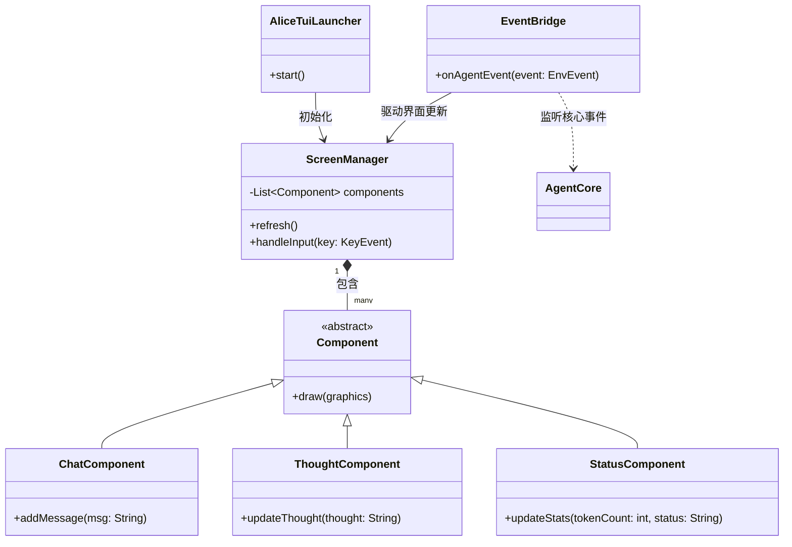
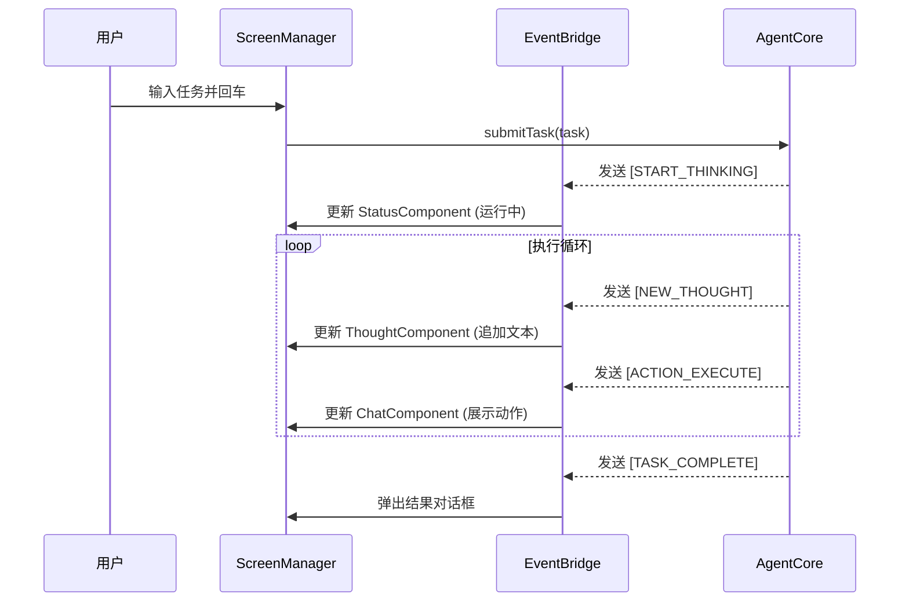
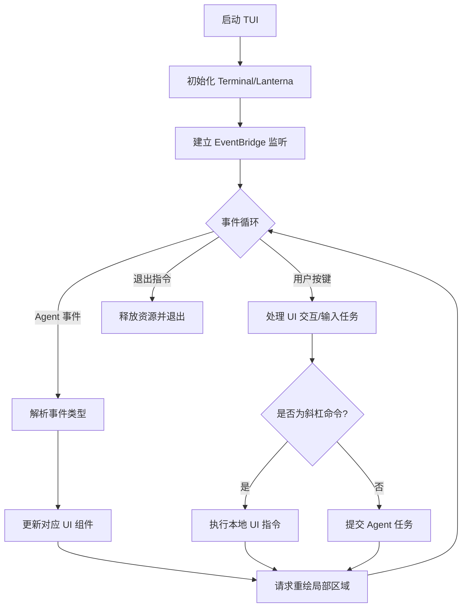

# alice-facade-tui 设计文档
## 目录
1. 模块概述
2. 实体关系图
3. 时序图
4. 业务流程图
5. 数据流图
6. 状态机
7. 功能用例与 TUI 布局
8. 模块实现细节

---

## 1. 模块概述
`alice-facade-tui` 是 Alice Agent 的**终端用户界面（TUI）外观模块**，核心定位：
- 提供**富交互、可视化**的任务监控面板
- 实时展示 Agent **思考链（Thought Stream）**、执行日志
- 支持**交互式任务提交**、快捷命令、状态监控

---

## 2. 实体关系图 (Entity Diagram)
展示 TUI 内部组件、核心层事件的关联关系。


---

## 3. 时序图 (Sequence Diagram)
展示 TUI **异步处理 Agent 事件 + 实时界面更新**的完整流程。


---

## 4. 业务流程图 (Flowchart)
描述 TUI **主事件循环 + 交互逻辑**。


---

## 5. 数据流图 (Data Flow Diagram)
展示 TUI 中**用户输入 → 核心处理 → 界面渲染**的异步数据流。
```
+----------------+      +----------------+      +------------------+
| User Keyboard  | Key  | ScreenManager  | Task |                  |
| (Input Area)   +----->| (Input Buf)    +----->|   AgentCore      |
+----------------+      +-------^--------+      +---------+--------+
                                |                         |
                                |                         | Event
        +----------------+      |       +-----------------v+
        |   Renderer     |      |       |   EventBridge    |
        | (Pixel/Char)   |      +-------+ (Message Queue)  |
        +-------+--------+              +------------------+
                |
                v
        +----------------+
        |   Terminal     |
        | (Display Grid) |
        +----------------+
```

---

## 6. 状态机 (State Machine)
描述 TUI 界面随 Agent 执行阶段的**状态转换**。
```
       +---------+          +----------+          +------------+
------>|  IDLE   |----+---->| INPUTING |----+---->|  RUNNING   |
       | (空闲)  |    |     | (输入中) |    |     | (思考执行) |
       +----^----+    |     +----------+    |     +-----+------+
            |         |                     |           |
            |         v                     v           |
            |    +---------+          +----------+      |
            +----+  ERROR  |<---------+ INTERVENE|<-----+
                 | (报错)  |          | (人工干预)|
                 +---------+          +----------+
```

---

## 7. 功能用例与 TUI 布局
### 7.1 界面布局设计 (Layout)
```
+-----------------------------------------------------------+
| [Alice Agent v1.0] | Model: GPT-4o | Status: Thinking...  |  <- Header
+---------------------------+-------------------------------+
|                           | [Thought Stream]              |
| [Chat History]            | > Checking file system...     |
| User: 清理日志文件        | > Found 5 log files.          |
| Agent: 正在扫描...        | > Analyzing usage...          | <- Main
|                           |                               |
|                           |                               |
+---------------------------+-------------------------------+
| [Input]: /exec ls -la______________________________________| <- Input
+-----------------------------------------------------------+
| F1:Help | F2:Settings | F5:Stop | Ctrl+C:Quit             | <- Footer
+-----------------------------------------------------------+
```

### 7.2 快捷键映射表
| 快捷键 | 动作说明 | 作用范围 |
| :----- | :------- | :------- |
| F1 / ? | 帮助：弹出操作说明与快捷键指南 | 全局 |
| F10 / q | 退出：安全关闭 TUI，释放终端 | 全局 |
| Ctrl + C | 强行中断：终止正在执行的 Agent 任务 | 全局 |
| Tab | 切换焦点：在输入框/聊天区/思考流区循环 | 全局 |
| Enter | 提交任务/命令：发送输入框内容 | 输入区域 |
| Esc | 取消/关闭：取消输入或关闭弹窗 | 交互状态 |
| PgUp / PgDn | 翻页滚动：滚动聚焦面板内容 | 内容面板 |
| F5 | 重置：等同于 /new 命令 | 全局 |

### 7.3 斜杠命令设计 (Slash Commands)
输入框以 `/` 开头触发快捷指令，由 TUI 拦截处理。

| 命令 | 动作说明 | 示例 |
| :--- | :------- | :--- |
| /new | 重置会话：清空上下文，开启新对话 | /new |
| /prompt | 加载提示词：读取外部文件作为系统提示 | /prompt ./system_v2.txt |
| /exec | 执行指令：运行 Shell 命令并将结果传给 Agent | /exec git log -n 5 |
| /model | 切换模型：动态修改当前使用 LLM | /model claude-3.5 |
| /clear | 清屏：仅清空 UI 显示内容 | /clear |
| /history | 历史回溯：展示最近执行记录快照 | /history |
| /tools | 查看工具：列出 Agent 可用工具集 | /tools |
| /exit | 安全退出：保存会话后关闭 TUI | /exit |
| /help | 命令帮助：列出所有斜杠命令 | /help |

### 7.4 典型使用场景
1. **引导式开发**
   - 用户输入：`/prompt ./standard_coding_style.md`
   - TUI 加载规范文件，通知 Agent 按规范生成代码

2. **环境感知协作**
   - 用户输入：`/exec netstat -ano | grep 8080`
   - TUI 将命令输出作为上下文，Agent 自动分析端口占用并给出建议

3. **快速重置**
   - Agent 陷入死循环时，输入 `/new` 快速重置对话环境

---

## 8. 模块实现细节
- **渲染引擎**：`Lanterna`（跨平台终端 UI 库）
- **输入处理**：`Lanterna` `KeyStroke` 事件监听（`screen.readInput()`），`InputComponent` 自绘输入框（非 JLine LineReader）
- **命令拦截逻辑**
  - **Type A（内部）**：`/new` `/clear` `/exit` 仅操作 UI/会话状态
  - **Type B（IO 操作）**：`/prompt` 读取文件并拼接为用户消息
  - **Type C（系统）**：`/exec` 调用 `ProcessBuilder` 捕获输出，作为上下文喂给 Agent
- **线程模型**
  - **UI 线程**：负责界面渲染循环
  - **Agent 线程**：独立执行，不阻塞 UI 交互

### 总结
1. 本文档完整定义了 `alice-facade-tui` 的**架构、交互、布局、命令、实现规范**
2. 采用异步事件驱动架构，实现**UI 与 Agent 执行解耦**
3. 聚焦**易用性 + 可视化**，支持快捷键、斜杠命令、实时监控，适配开发者日常高效操作
