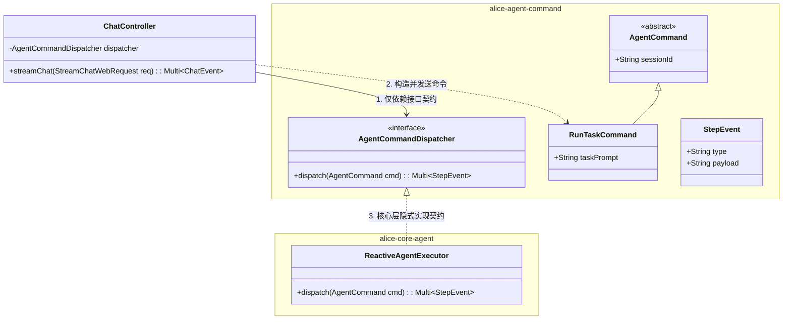
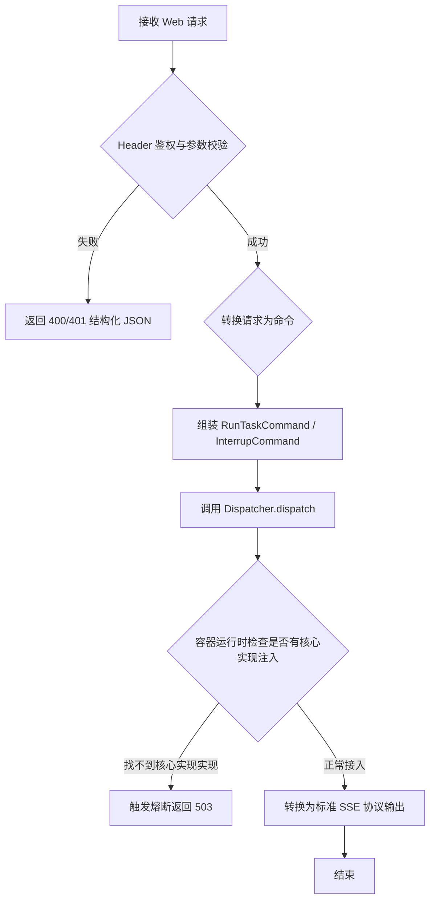

这个调整切中了面向接口编程（Design on Interface）**以及**依赖倒置原则（Dependency Inversion Principle）的核心。

直接依赖 `alice-core-agent` 会导致 Web 门面层深度耦合核心层的实现细节。引入一个专门的命令/契约层 `alice-agent-command`（或 `alice-agent-api`），让 Web 门面只依赖命令定义与接口契约，而具体的执行引擎（`core-agent`）在运行时才被注入，这样能极大提升系统的解耦度度。

以下是调整依赖拓扑后，重新修正的 **`alice-facade-web` 技术设计文档**：

---

# alice-facade-web 设计文档

### 元数据定义 (Metadata)

* **title**: "ALICE-FACADE-WEB DESIGN"
* **summary**: "Web facade design - Quarkus reactive architecture, depending on alice-agent-command for decoupling from core implementation"
* **read_when**:
* "修改 Web 门面、调整解耦协议、或重构核心命令契约时"


* **scope**: ["alice-facade-web"]
* **status**: "active"
* **updated**: "2026-06-18"

---

## 1. 模块概述 (Overview)

* **基本定位**：属于 **门面层 (Facade Layer)**。
* **核心职责**：
* **协议转换与流式推送**：将命令契约层返回的响应式数据流转化为 Web 端的 **SSE** 或 **WebSocket** 发送给前端。
* **命令分发与路由**：接收 Web HTTP/WS 请求，将其组装为统一的 Command DTO，分发给命令通道。
* **严格的解耦防线**：**禁止直接依赖 `alice-core-agent**`。本模块只允许引入 `alice-agent-command` 模块。通过接口与命令 DTO 实现与核心层实现的彻底隔离。


* **技术选型**：
* **Quarkus (Java 25)**：提供响应式 Web 容器支持。


---

## 2. 架构拓扑与交互图 (必填)

### 2.1 静态组件关系 (Class Diagram)

> **设计变更说明**：Web 控制器不再持有 `AgentExecutor` 的具体实现，而是持有 `alice-agent-command` 中定义的 **`AgentCommandDispatcher`** 接口与命令对象。



### 2.2 动态时序流 (Sequence Diagram)

展示基于命令解耦后，请求通过契约层分发，在运行时动态由核心实现层响应的动态逻辑。

```mermaid
sequenceDiagram
    participant Client as 浏览器 (Chat UI)
    participant Web as ChatController
    contract alice-agent-command as 命令契约层
    participant Core as ReactiveAgentExecutor (核心层)

    Client->>Web: POST /api/v1/chat/stream
    Note over Web: 组装契约层命令对象
    Web->>Web: create RunTaskCommand(sessionId, prompt)
    
    Web->>Core: dispatcher.dispatch(command)
    Note over Web,Core: 基于暴露的接口和 StepEvent 传输流<br/>不感知 Core 的具体 ReAct 引擎细节
    
    activate Core
    Core-->>Web: Multi<StepEvent> (流式脉冲事件)
    deactivate Core
    
    Web-->>Client: HTTP 200 (text/event-stream)
    loop SSE 脉冲转发
        Web-->>Client: data: {"type":"thought", ...}
    end

```

---

## 3. 核心行为与逻辑判定 (可选)

### 3.1 业务流程图 (Flowchart) —— 命令组装与分发判定 [可选]



---

## 4. 数据模型与存储设计 (必填/本模块为纯无状态)

* **模块状态声明**：由于模块彻底与核心层解耦，其本身作为无状态路由门面的特性更加纯粹。
* **数据模型归属**：所有关于持久化存储、WAL 结构的代码实体全部**下沉到契约层或核心层之后**。`alice-facade-web` 仅引入 `alice-agent-command` 中的网络 DTO 传输规约：

### 4.1 网络 DTO 传输规约 (由 command 模块定义，Web 模块复用)

| DTO 类名 | 字段名 | 类型 | 说明 |
| --- | --- | --- | --- |
| `RunTaskCommand` | `sessionId` | `String` | 全局唯一分布式雪花 ID |
| `RunTaskCommand` | `taskPrompt` | `String` | 用户输入的 Prompt 原始文本 |
| `StepEvent` | `eventType` | `String` | 事件状态：`THOUGHT` / `TOOL_CALL` / `SUMMARY` |

---

## 5. 功能用例与接口设计 (必填)

### 5.1 暴露接口路由表

| HTTP 方法 | 接口路由 | 功能描述 | 映射的底层 Command (契约层) |
| --- | --- | --- | --- |
| **POST** | `/api/v1/session` | 初始化 Agent 会话上下文 | `InitSessionCommand` |
| **POST** | `/api/v1/chat/stream` | 输入任务并获取打字机 SSE 推送 | `RunTaskCommand` |
| **POST** | `/api/v1/chat/interrupt` | 用户在前端强行中止当前 Agent 推理 | `InterruptTaskCommand` |

---

## 6. 模块实现细节与物理规范 (必填)

### 6.1 技术栈与三方件精细引入

* **核心模块依赖**：
* 项目内部依赖：`project(":alice-agent-command")`
* 框架依赖：`vert.x` (Mutiny 响应式流支持)


* **设计模式应用**：
* **依赖倒置原则/中介者模式**：Web 门面扮演纯粹的“发令枪”，通过注入 `AgentCommandDispatcher` 抽象，彻底断开与 `core-agent` 在编译期的联系。


### 6.2 异常与网络状态码映射 (Error Mapping)

| 契约层异常 / 错误码 | 触发根因说明 | 外部网络行为反馈 (HTTP Status) |
| --- | --- | --- |
| `CommandExecutionException` | 核心实现层在执行命令时崩溃或超时 | 返回 `500 Internal Server Error` |
| `CommandValidationException` | 契约层对 Command 字段校验不通过 | 返回 `400 Bad Request` |
