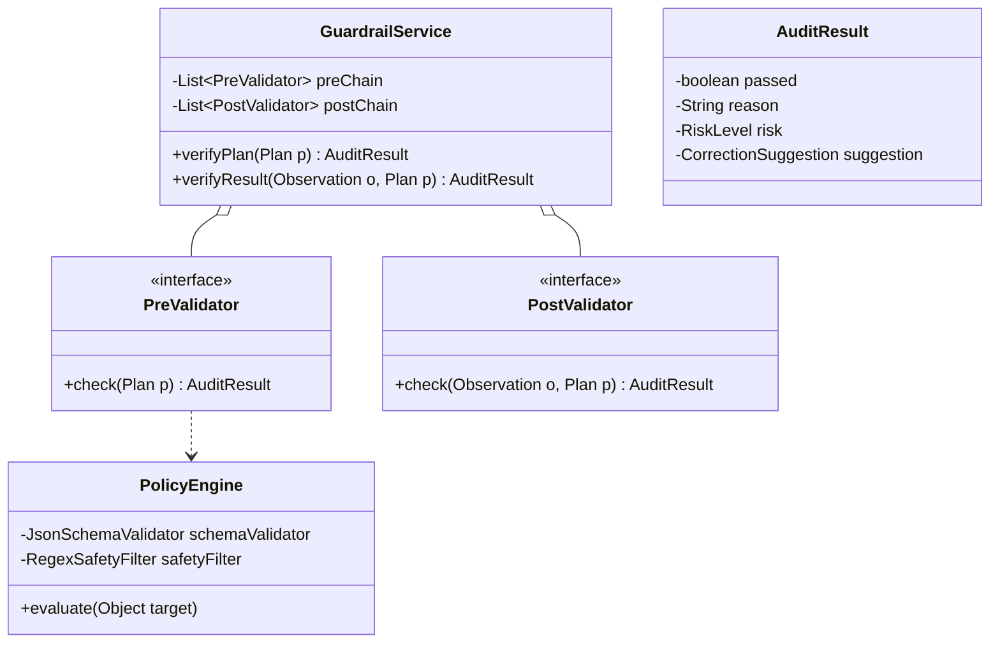
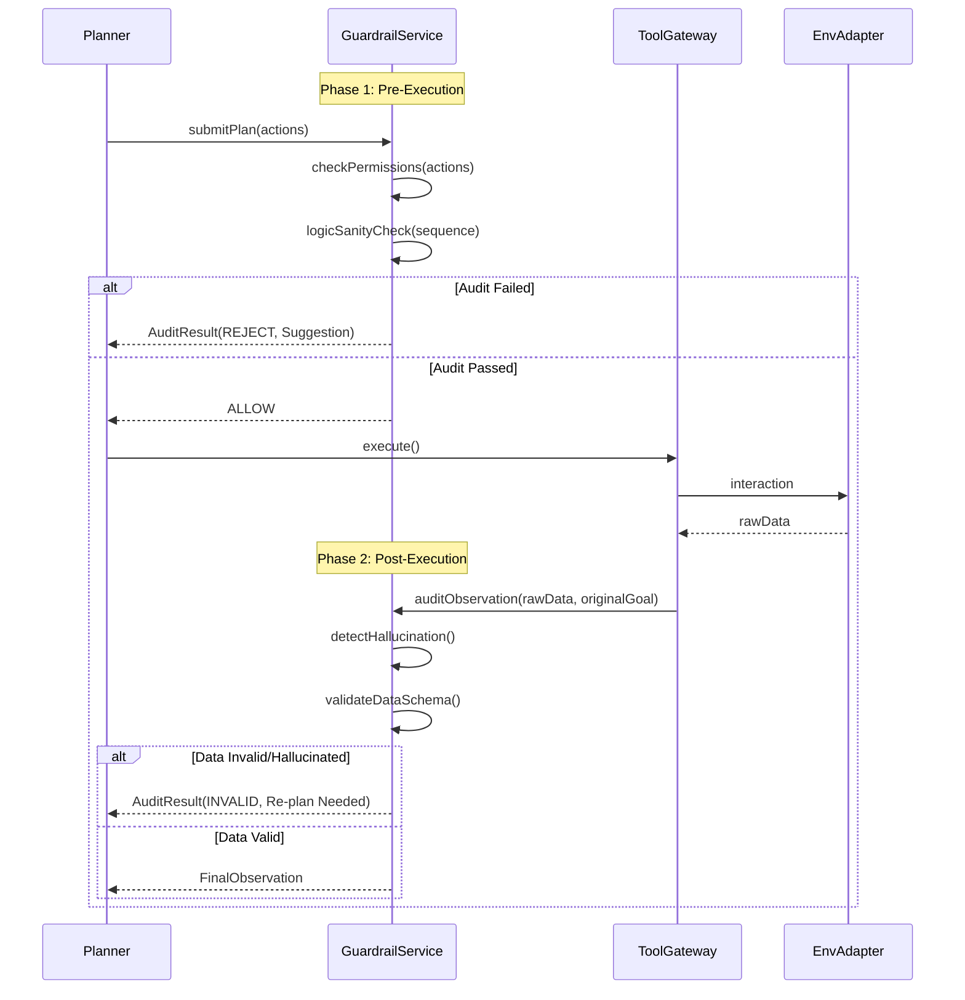

针对 **alice-guardrail** 的设计，其核心逻辑是将"安全"与"正确性"从执行链路中剥离，形成一个独立的**审校委员会**。它不仅是拦截器，更是 Agent 自我进化的监督者。

---

## **1. 模块类图 (Guardrail Classes)**

设计采用 **拦截器链 (Interceptor Chain)** 模式，支持动态扩展验证规则。




---

## **2. 验证时序与反馈流 (Verification Flow)**

展示 V 层如何干预 P 层的决策，以及如何处理"幻觉"检测。




---

## **3. 核心功能设计细节**

### **3.1 Plan 验证 (Pre-Execution)**
* **权限沙箱**：基于你定义的 MCP 能力，验证 Agent 是否试图访问超出其 Scope 的资源（如：试图删除核心系统目录）。
* **逻辑闭环检查**：验证推理路径是否存在逻辑死循环，或者所需的工具输入是否在当前上下文（Context）中已获得。

### **3.2 结果验证 (Post-Execution)**
* **幻觉检测 (Hallucination Detection)**：
    * **引用检查**：如果 Observation 中包含事实性陈述，V 层会通过 `SemanticVault` 交叉验证其真实性。
    * **一致性评估**：比较 LLM 预测的输出类型（Expected Type）与工具实际返回的类型是否匹配（例如：预期 JSON，实则 HTML）。
* **副作用审计**：检测 Act 后的环境状态变化是否超出了预期。

---

## **4. 验证决策状态机 (ASCII)**

```text
       [ INPUT RECEIVED ]
               |
      +--------v---------+
      |  PRE-EXEC AUDIT  | <----------+
      +--------+---------+            |
               |                      |
      (Reject) +------> [ LOG REASON & REQUEST FIX ]
               |                      ^
       (Pass)  |                      |
               v                      |
       [ TOOL EXECUTION ]             |
               |                      |
      +--------v---------+            |
      | POST-EXEC AUDIT  | -----------+ (Refine/Retry)
      +--------+---------+
               |
      (Fail)   +------> [ FLAG AS UNTRUSTED ]
               |
       (Pass)  +------> [ COMMIT TO MEMORY ]
```

---

## **5. 架构师实现建议**

1.  **确定性验证 vs. 概率性验证**：
    * 对于 **Security (安全)**，使用确定性代码逻辑（Regex, JsonSchema, Policy-as-Code）。
    * 对于 **Logic (幻觉/意图)**，调用轻量级 LLM（如 Qwen-7B）作为"独立评审员"进行二次确认，实现"模型验证模型"。
2.  **验证层与分布式追踪 (Tracing)**：
    鉴于你在开发 `cland-user-service` 等微服务，建议将 V 层的审计结果注入到 OpenTelemetry 的 Trace 中。这样当 Agent 做出错误决策时，你可以通过 Trace 清楚地看到是哪一步验证漏网。
3.  **针对"一人公司"的优化**：
    因为是 solo 模式，V 层可以增加一个 **"Human-in-the-loop"** 开关。对于高风险动作（如：删除数据库、发送外部公函），V 层在 `AuditResult` 中标记为 `MANUAL_CONFIRM`，挂起任务流并向你发送通知（如通过 CLI 提示或 Webhook）。

这层 V (Verify) 是 `alice-agent` 区别于普通脚本的关键：它让智能体拥有了"审慎"这种高级认知属性。
