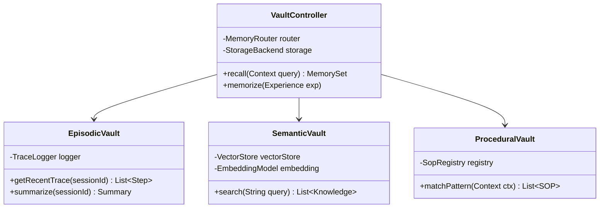
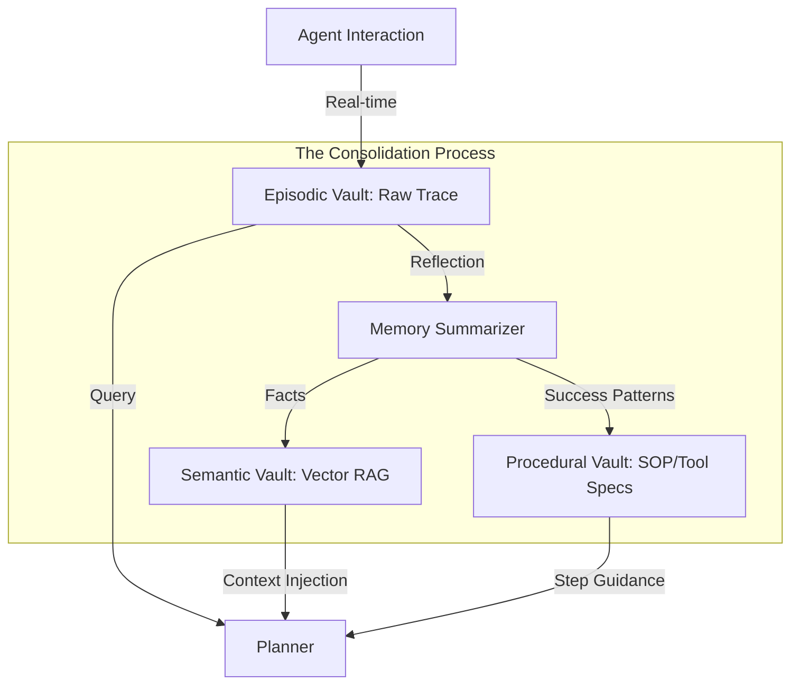
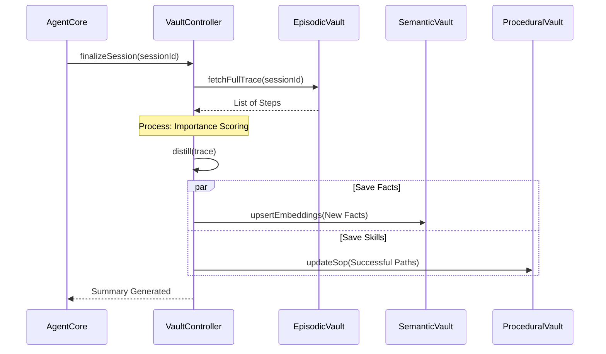

针对 **alice-memory-vault** 的设计，核心在于将人类的记忆分类学引入软件工程。这不仅仅是数据库的堆砌，而是一套**分层检索与生命周期管理系统**，确保 Agent 在推理时既能“记得住细节”，又能“拎得清重点”。

---

## **1. 模块类图 (Memory Vault Classes)**

设计采用**组合模式**，将三种记忆类型统一在 `VaultController` 下，通过 `MemoryRouter` 进行路由。




---

## **2. 记忆存取数据流图 (Memory Lifecycle)**

展示数据如何从“原始交互”转化为“长期资产”。




---

## **3. 三级记忆的技术栈映射**

| 记忆类型 | 物理载体建议 | 检索机制 | 核心职责 |
| :--- | :--- | :--- | :--- |
| **Episodic (情节)** | Redis / PostgreSQL | Session ID + 时间戳降序 | 提供会话连贯性，支持 ReAct 循环中的状态回溯。 |
| **Semantic (语义)** | Qdrant / Milvus | 向量相似度 (HNSW) | 提供非结构化知识支持（如：项目文档、技术手册）。 |
| **Procedural (程序)** | YAML / Git / Local Files | 模式匹配 / 语义路由 | 存储“最佳实践”和 MCP 工具的使用 Schema。 |

---

## **4. 关键交互时序：记忆合并 (Memory Consolidation)**

Agent 不应只会被动读取，更应在后台进行“睡眠式”处理（Consolidation）。



---

## **5. 状态机：记忆检索状态 (ASCII)**

描述 Planner 如何从 Vault 中提取信息的逻辑：

```text
       [ QUERY RECEIVED ]
               |
               v
    +-----------------------+
    |  ROUTING TO EPISODIC  | ----> (Match: "What did we just do?")
    +-----------------------+
               |
               v
    +-----------------------+
    |  ROUTING TO SEMANTIC  | ----> (Match: "What is this technology?")
    +-----------------------+
               |
               v
    +-----------------------+
    | ROUTING TO PROCEDURAL | ----> (Match: "How to execute this tool?")
    +-----------------------+
               |
               v
       [ KNOWLEDGE FUSION ]
               |
               v
       [ CONTEXT WINDOW INJECT ]
```

---

## **6. 架构师深度建议**

1.  **忘记（Forgetting）也是一种能力**：
    由于 LLM 的 Context Window 有限，`EpisodicVault` 必须实现 **“遗忘策略”**。建议采用 **LRU + 重要度评分**。如果某一步推理被后续证明是错误的，其权重应降低，防止干扰后续规划。
2.  **程序记忆的“版本控制”**：
    `ProceduralVault` 建议与你的 **Docs-as-Code (Docusaurus/Markdown)** 工作流集成。当你在文档中更新了一个工具的使用 SOP 时，Agent 应能通过 CI/CD 自动加载更新后的 `build.zig.zon` 或其他规范。
3.  **记忆隔离**：
    虽然是“一人公司”，但建议在 `SemanticVault` 中实施 **Collection 隔离**。例如，`Project-C-Land` 的私有 API 文档不应在处理通用技术咨询时被误检索，以减少 Token 噪声。

通过这个三级架构，`alice-memory-vault` 就不再是一个简单的数据库，而是一个能够随着 Agent 经验增长而不断进化的**数字大脑**。
