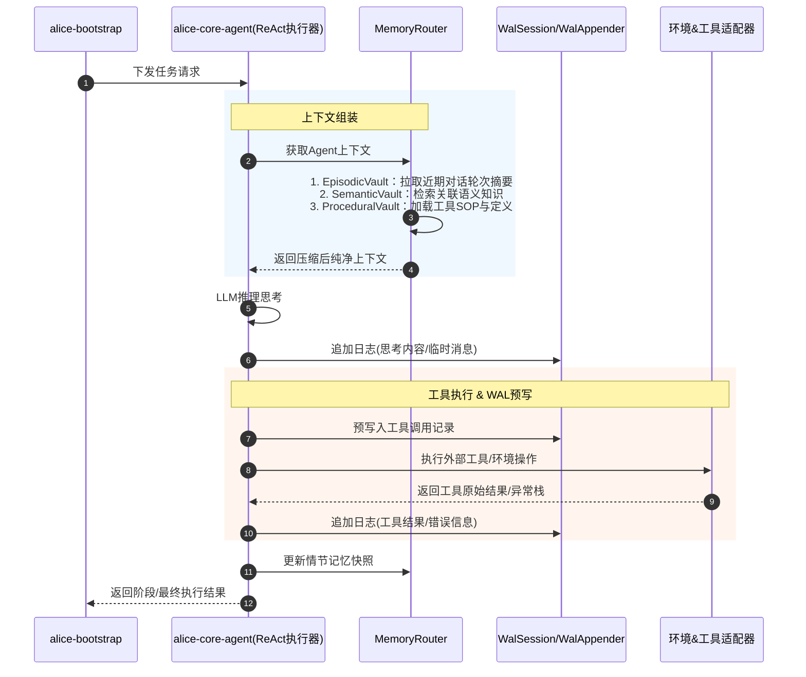
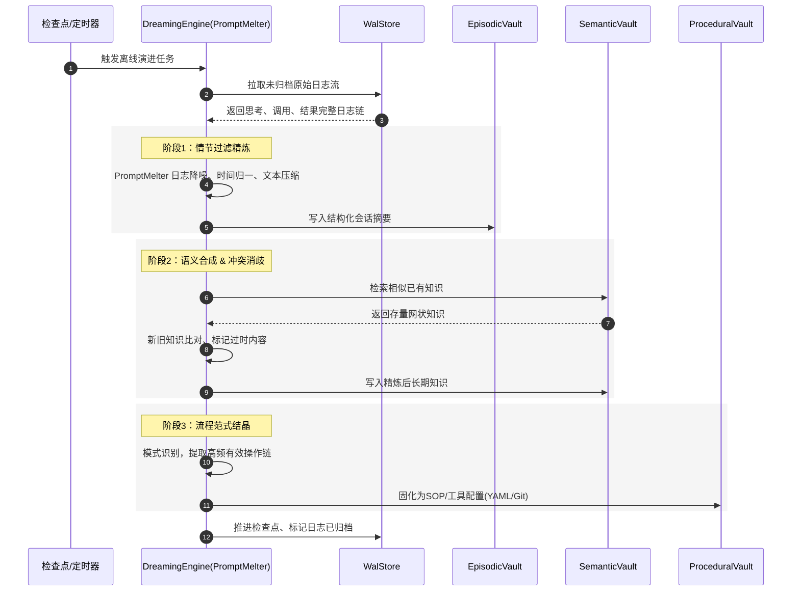

# Alice Agent 记忆体系 + ReAct/Dreaming 流程 结构化规整版
## 一、整体架构总览
核心双平面设计：**在线ReAct执行平面（高可用、崩溃恢复）** + **离线Dreaming演进平面（记忆精炼、知识沉淀）**
底层依赖：`alice-memory-vault` 三层记忆库 + WAL预写日志 = 全链路可追溯、可恢复、可进化

| 分层 | 核心能力 | 核心组件 | 运行模式 |
| ---- | ---- | ---- | ---- |
| 在线执行层 | ReAct循环、工具调用、上下文组装、崩溃安全 | AgentExecutor、WalSession、WalAppender | 同步实时 |
| 离线演进层 | 日志熔炼、记忆归纳、知识固化、检查点归档 | PromptMelter、DreamingEngine、CheckpointManager | 异步后台/定时触发 |
| 记忆存储层 | 短期情节、长期语义、流程范式 | EpisodicVault、SemanticVault、ProceduralVault | 持久化存储 |
| 路由网关层 | 统一读写分发、多库并发查询 | MemoryRouter | 统一入口 |

---

## 二、核心流程时序（标准化）
### 1. 在线平面：基于WAL的 ReAct 执行流程
**目标**：任务实时执行、上下文轻量化、操作全日志、崩溃可恢复


### 2. 离线平面：Dreaming 幻梦演进管线
**触发时机**：系统空闲、定时轮询、日志达到Checkpoint阈值
**目标**：原始日志降噪精炼、知识归纳、范式固化、日志归档截断


---

## 三、核心状态机（文本标准态迁图）
### 1. WalSession 会话生命周期状态机
**作用**：管控单次Agent会话全生命周期，实现崩溃恢复、归档回收
```
        [ CREATED ]
             |
       start_session()
             v
        [ RUNNING ]
  ┌───────────┴───────────┐
  │                       │
task_complete()     崩溃/OOM(crash/OOM)
  │                       │
  v                       v
[ COMPLETED ]         [ CRASHED ]
  │                       │
  │         recover_engine.replay()
  └───────────────────────┘
             |
    触发Dreaming(阈值/空闲)
             v
        [ DREAMING ]
      (后台异步熔炼)
             |
    PromptMelter执行成功
             v
        [ ARCHIVED ]
    (日志截断/冷归档/释放空间)
             |
             └───────────────┐
                             │
                        回到[CREATED] 复用会话
```

**状态说明**
- `CREATED`：会话初始化完成，未开始执行
- `RUNNING`：会话正常运行，持续写入WAL日志
- `CRASHED`：异常中断，待恢复引擎重放日志续跑
- `COMPLETED`：任务正常结束，等待离线处理
- `DREAMING`：后台记忆精炼中，会话只读锁定
- `ARCHIVED`：日志落地三层记忆库，原始WAL可清理

### 2. Memory Block 记忆块演进状态机
**作用**：定义单条信息从临时日志 → 短期记忆 → 长期知识 → 固定流程的完整演化链路
```
[ Raw Log Stream ] 原始WAL日志流
        |
  1.情节过滤提炼
        v
    [ EPHEMERAL ]
  临时情节记忆(短期时效)
        |
  2.识别高价值长期信息
        v
    [ ACTIVE ]
  有效语义知识(长期可用)
   ┌────┴────┐
   │         │
冲突检测     3.流程结晶
   │         │
   v         v
[DEPRECATED] [CRYSTALLIZED]
标记过时     固化为SOP/工具范式
   │
  GC清理
   v
   [ VOID ] 彻底销毁
```

**状态说明**
- `EPHEMERAL`：短期会话记忆，存于`EpisodicVault`，有时效性
- `ACTIVE`：有效语义知识，存入`SemanticVault`，参与RAG检索
- `DEPRECATED`：知识被新结论推翻，标记过期等待回收
- `CRYSTALLIZED`：反复验证的成功流程，固化为标准操作范式
- `VOID`：无效记忆，完成垃圾回收

---

## 四、模块职责与工程落地规范
### 1. 核心组件职责映射
| 组件类 | 所属模块 | 核心职责 | 对应流程环节 |
| ---- | ---- | ---- | ---- |
| `WalSession` / `WalAppender` | alice-memory-vault | 日志追加、会话状态管理、预写日志 | 在线ReAct全链路日志落盘 |
| `RecoveryEngine` | alice-memory-vault | 异常会话检测、日志重放、崩溃恢复 | WalSession `CRASHED` 状态恢复 |
| `MemoryRouter` | alice-memory-vault | 三层记忆库统一路由、并发查询、上下文组装 | 在线阶段上下文获取、情节状态更新 |
| `PromptMelter` | alice-memory-vault | 日志降噪、文本压缩、结构化提炼 | Dreaming 阶段 情节精炼 |
| `DreamingEngine` | alice-memory-vault | 驱动离线全管线、知识比对、范式提取 | 完整Dreaming Pipeline |
| `CheckpointManager` | alice-memory-vault | 定时/阈值触发、检查点标记、日志截断 | 离线任务触发 & WAL归档 |
| `AgentExecutor` | alice-core-agent | ReAct循环、LLM推理、工具调度 | 在线核心执行逻辑 |

### 2. 落地强制规范
1. **启动优先级**
   应用启动 → `RecoveryEngine` 优先扫描异常`WalSession`并执行重放恢复 → 再正常受理新任务。
2. **在线读写约束**
   所有上下文读取、记忆更新**必须经过`MemoryRouter`**，禁止直连三层Vault。
3. **WAL写入规则**
   工具调用**先预写日志、再执行工具**；无论成功/异常，结果必须回写WAL，保证日志完整性。
4. **离线任务约束**
   Dreaming为纯异步后台任务，**不阻塞在线业务**；熔炼过程中锁定对应`WalSession`，禁止重复处理。
5. **记忆淘汰规则**
   `DEPRECATED` 过期记忆统一由后台GC任务定时清理；临时`EPHEMERAL`情节记忆配置TTL自动过期。

### 3. 模块依赖关系（Gradle 参考）
```
alice-bootstrap
    └── alice-core-agent
            ├── alice-env-adapter
            └── alice-memory-vault （强依赖，读写记忆与WAL）
alice-memory-vault （独立核心模块，含所有记忆、WAL、离线引擎）
```

---

## 五、核心能力总结
1. **高可用**：WAL预写日志 + 会话状态机 + 恢复引擎，实现全场景崩溃恢复。
2. **轻量化上下文**：三层记忆分层检索+摘要压缩，避免原始日志膨胀。
3. **自进化**：离线Dreaming管线完成「日志→短期记忆→长期知识→标准流程」全自动沉淀。
4. **边界清晰**：多模块职责解耦，路由层统一收口，便于迭代、测试与扩展。