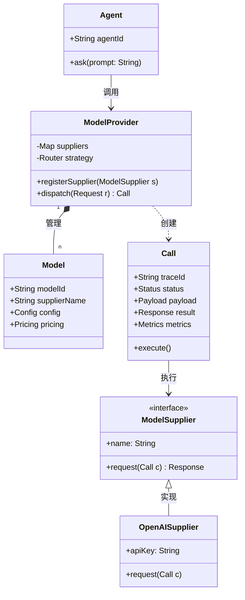
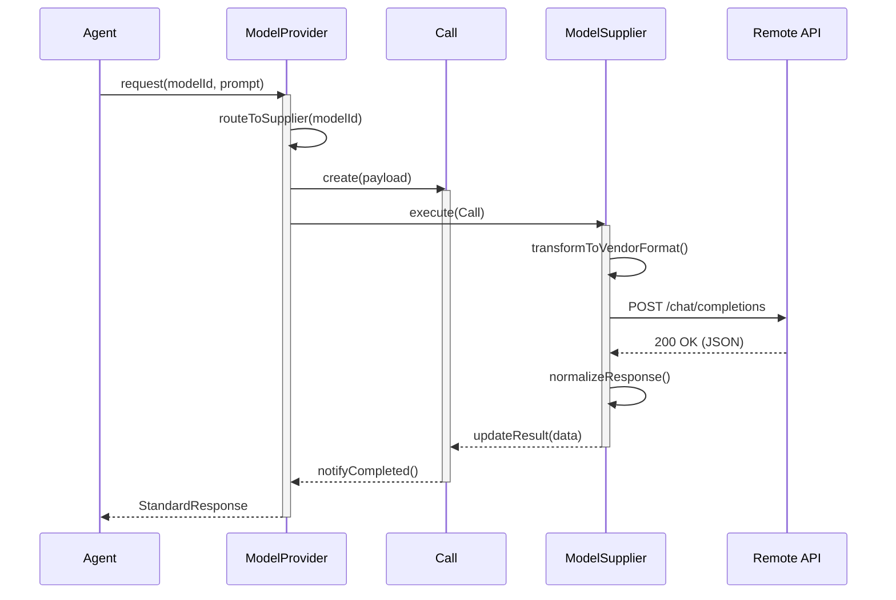

这是一个针对大模型 Agent 架构中 **ModelProvider 链路**的系统设计文档。

---

## 1. 系统设计文档 (Markdown)

### 1.1 概述
本设计旨在构建一个高可用、可扩展的模型接入层。通过解耦 **Agent（业务逻辑）** 与 **ModelSupplier（物理 API）**，实现多模型热切换、成本统计及统一的状态管理。

### 1.2 核心领域对象
* **ModelProvider**: 核心入口，负责模型注册、策略路由及 Supplier 调度。
* **Model**: 模型元数据定义，包含能力标签（Function Call, Vision 等）及成本权重。
* **Call**: 调用的生命周期实例，承载请求参数、执行状态及性能指标。
* **ModelSupplier**: 物理适配器，负责将标准请求转换为特定厂商的 API 协议。

---

## 2. 类图 (Class Diagram)



---

## 3. 数据流图 (Data Flow)
以“一次聊天请求”为例：

1.  **[Agent]** -> 发送 `Prompt + ModelID` -> **[ModelProvider]**
2.  **[ModelProvider]** -> 查询 `Model Meta` -> **[ModelConfig]**
3.  **[ModelProvider]** -> 创建 `Call(Context, Params)` -> **[Call Object]**
4.  **[Call Object]** -> 格式化为 `Vendor JSON` -> **[ModelSupplier]**
5.  **[ModelSupplier]** -> 网络请求 -> **[Remote API (OpenAI/Anthropic)]**
6.  **[ModelSupplier]** -> 解析 `Standard Response` -> **[Call Object]**
7.  **[Call Object]** -> 更新 `Token Usage & Latency` -> **[Monitor/Agent]**

---

## 4. 时序图 (Sequence Diagram)



---

## 5. 状态机 (Status Machine - ASCII)

`Call` 对象的生命周期状态转换：

```text
       +---------+          +---------+          +------------+
------>| CREATED |--------->| PENDING |--------->|  RUNNING   |
       +---------+          +---------+          +------------+
           |                     |                     |
           | (Validation Fail)   | (Network Timeout)   | (Stream Error)
           v                     v                     v
       +---------+          +---------+          +------------+
       | ABORTED |          |  RETRY  |          |   FAILED   |
       +---------+          +---------+          +------------+
                                 |                     |
                                 +----------+----------+
                                            |
                                            v
                                     +------------+
                                     |  FINISHED  | (Success / Terminal Fail)
                                     +------------+
```

## 6. 配置
[CONFIG.MD](CONFIG.md)

### 状态说明：
* **CREATED**: 对象的初始化，参数已校验。
* **PENDING**: 进入调度队列，等待供应商槽位。
* **RUNNING**: 正在进行网络请求或流式读取（Streaming）。
* **FINISHED**: 最终态，已记录 Token 消耗并返回 Agent。
