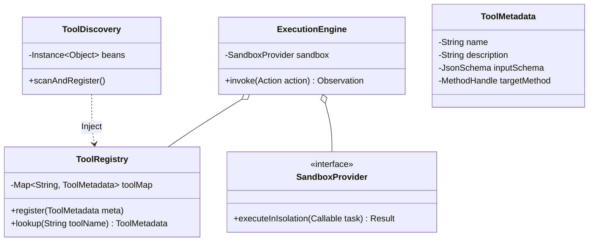
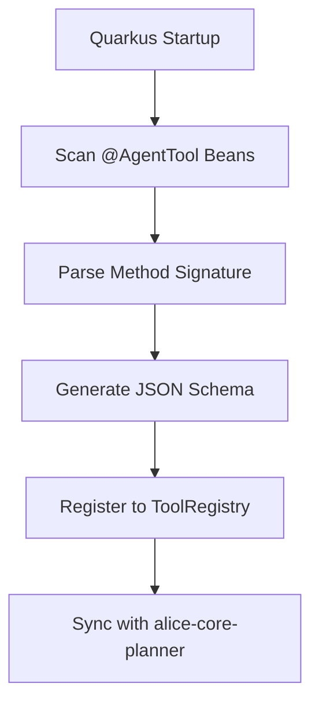
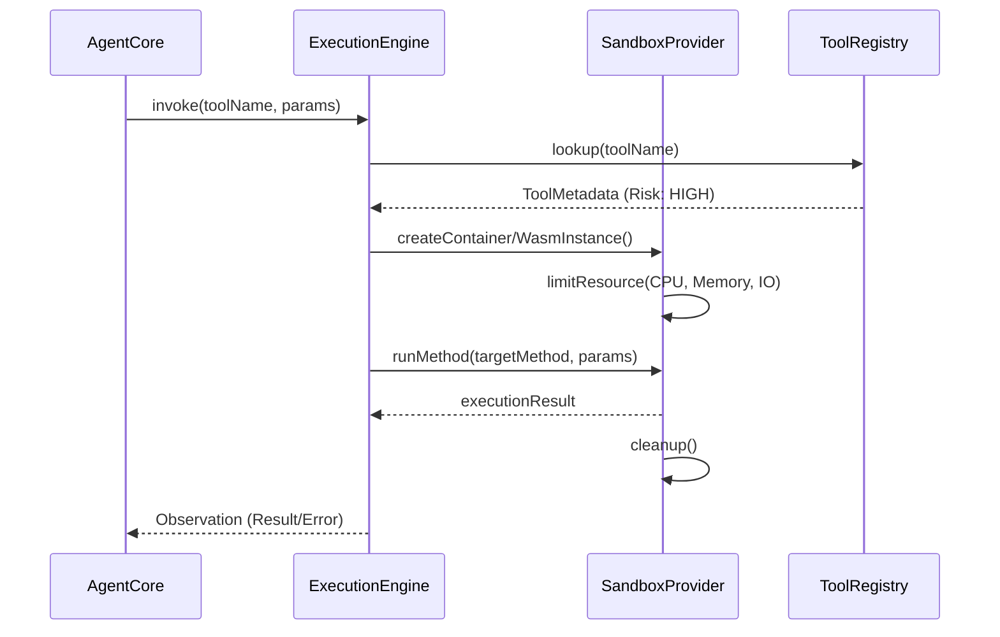

针对 **alice-tool-gateway** 的设计，核心在于将 **Java 强类型方法** 与 **LLM 弱类型 JSON 调用** 进行无缝桥接，同时确保执行过程的物理安全性。它是 Agent 的“手”，既要灵活有力，又要戴上手套（沙箱）。

---

## **1. 模块类图 (Tool Gateway Classes)**

设计利用 Quarkus 的 CDI 特性实现自动化注册，并采用 **命令模式 (Command Pattern)** 封装工具执行。




---

## **2. 动态能力注入流程 (CDI + Reflection)**

展示如何将一个普通的 Java Bean 方法转化为 Agent 可调用的工具。



### **代码示例 (Quarkus 风格)**
```java
@ApplicationScoped
public class SystemTools {
    
    @AgentTool(name = "file_reader", description = "Reads content from a local file")
    @RiskLevel(HIGH) // 标记为高危，触发沙箱
    public String readFile(@ToolParam("path") String path) {
        // 实际逻辑
        return Files.readString(Path.of(path));
    }
}
```

---

## **3. 沙箱执行时序图 (Sandbox Isolation)**

对于高危操作，`ToolGateway` 会拦截调用并重定向至隔离环境。




---

## **4. 核心功能设计细节**

### **4.1 动态 JSON Schema 映射**
* **输入转换**：使用 Jackson 或 Typebox 类似的逻辑，将 Java 方法参数自动推导为标准的 JSON Schema，以便 Planner 直接读取并生成正确的 `arguments`。
* **输出序列化**：将 Java 的 POJO 返回值统一序列化为 JSON 字符串，作为 Observation 喂回给 LLM。

### **4.2 多级沙箱策略**
* **Level 1 (Direct)**：只读操作或无副作用的计算，在 JVM 线程池内直接执行。
* **Level 2 (Jail/Policy)**：受限的物理路径访问，利用 Java 的 `SecurityManager` (或现代替代方案) 限制文件系统/网络权限。
* **Level 3 (Full Sandbox)**：代码生成并运行（如 Python 代码块）、Shell 脚本。强制分发至 Docker 容器或 WebAssembly 运行时。

---

## **5. 工具执行状态机 (ASCII)**

```text
       [ REQUEST RECEIVED ]
               |
               v
      /-----------------\
     |   RISK ANALYZER   |
      \-------+---------/
              |
      +-------+-------+
      |               |
 [ DIRECT EXEC ]   [ SANDBOX EXEC ]
      |               |
      |        (PRE-WARM CONTAINER)
      |               |
      |        (RESOURCE LIMITS)
      |               |
      +-------+-------+
              |
              v
      [ RESULT WRAPPER ]
              |
      [ EMIT OBSERVATION ]
```

---

## **6. 架构师实现建议**

1.  **关于 @AgentTool 的极致解耦**：
    建议在 `alice-tool-gateway` 中不引用具体的业务逻辑，而是通过 `ToolRegistry` 作为一个纯粹的 **能力目录**。这方便你将来把某些工具部署为独立的微服务，通过 MCP 协议挂载，而无需重新编译 `alice-core-agent`。
2.  **错误处理的语义化**：
    当工具执行失败（如文件不存在）时，不要只返回 Java StackTrace。`ToolGateway` 应拦截异常，并转化为 LLM 可理解的**描述性错误**（例如：“文件 /etc/config 无法读取，请确认路径或权限”），这有助于 Planner 进行 `Re-plan`。
3.  **针对“一人公司”的效率工具**：
    由于你经常处理 Rust/Java 代码，建议在沙箱中内置一个 `Zig-based` 或 `Rust-based` 的快速编译器环境，让 Agent 能在沙箱内原地验证代码段的正确性，再提交到主仓库。

通过 `alice-tool-gateway`，你将业务代码（Bean）变成了 Agent 的原语，实现了**业务逻辑与智能推理的工程化统一**。至此，P-E-M-T-V 五大核心模块设计已完整闭环。
